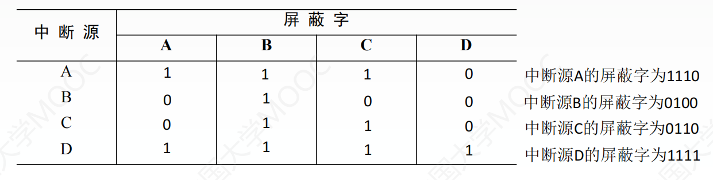
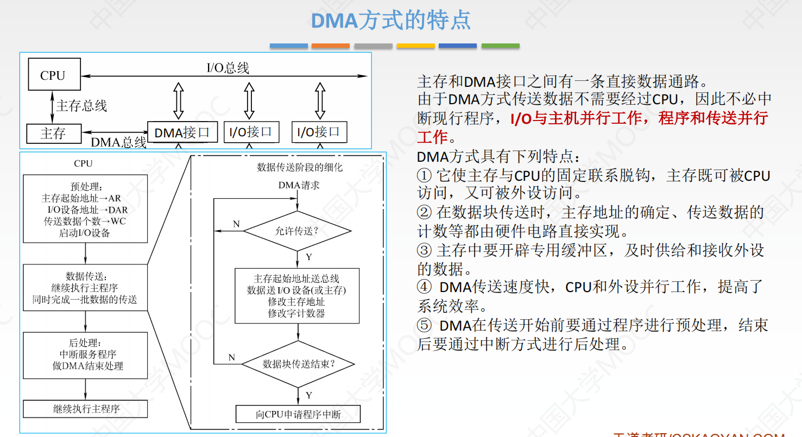

# 第一章 计算机系统概述

# 第二章 数据的表示与运算

## 一、定点数

### 定点数的常识

##### 1.有符号数和无符号数的关系

同一个二进制运算，计算机可以将它当做无符号数来运算，也可以当做有符号数来运算。
有无符号只是人为的看待方式不同。
例如加法，不管我们如何看待，CPU运算时就已经包含了两种含义，仅仅是简单的相加

##### 2. 无符号数和有符号数混合加法

+ 只需要保持位数相同后，直接按无符号数的方式直接相加
+ 有符号数高位需补充符号位

例. $无符号8(1000)和-3(1101)相加，结果为(1)0101,高位溢出,但有效位表示的值为5,是正确结果$

$无符号F0000000H+有符号FF12H,FF12H补全后为FFFFFF12H,相加得到EFFFFF12H,也是正确结果$

### 标志位

## 二、浮点数

# 第三章 存储系统

# 第四章 指令系统

## 一、指令格式

## 二、寻址方式

+ 分为指令寻址和数据寻址

### 指令寻址

### 数据寻址

## 三、程序的机器级表示

### 汇编语言

## 四、CISC和RISC

# 第五章 CPU

# 第六章 总线

# 第七章 I/O

## I/O接口

#### 基本结构与工作原理

+ **I/O端口**：I/O接口中**可被CPU直接访问的寄存器**，作用是**协调CPU与设备间速度的不匹配**
+ 发命令：发送**命令字**到I/O控制寄存器，获得设备或I/O控制器的状态信息
+ 读状态：从状态寄存器读**状态字**，获得设备或I/O控制器的状态信息
+ 读/写数据：从数据缓冲寄存器发送或读取数据，完成主机与外设的数据交换

#### I/O端口

> **I/O端口**：I/O接口中**可被CPU直接访问的寄存器**，作用是**协调CPU与设备间速度的不匹配**

#### I/O编址方式

## I/O方式

### 程序查询方式

#### 三种方式简介

#### 特点

+ 主要特点：CPU**“踏步”等待**，与I/O设备**串行**工作
+ 优点：接口设计简单，设备量少
+ 缺点：CPU需要花大量时间查询和等待，效率极低
+ 不适合慢速设备（慢速设备查询次数非常多）

#### 两种查询方式

+ 独占查询：CPU 100%时间都在查询I/O状态，完全串行
+ 定时查询：保证数据不丢失情况下，每隔一段时间就查询一次。
  查询间隔内CPU可以执行其他程序

### 程序中断方式

#### 中断判优

##### 实现方法

+ 中断判优即可通过硬件实现，也可用软件实现
  软件实现慢

##### 一般的优先级设置

1. 不可屏蔽中断>内部异常>可屏蔽中断
   不可屏蔽中断在关中断下也会被响应
2. 内部异常中：硬件故障>软件中断
3. DMA请求>I/O设备的中断请求
4. 高速设备>低速设备
5. 输入设备>输出设备
6. 实时设备>普通设备

#### 多重中断

##### 满足的条件

1. 保护现场和屏蔽字后需要开中断
   不能再之前就开中断，否则保护现场会失败
2. 保存中断处理优先级

##### 中断屏蔽字

+ 每个中断源对其他所有中断源都有一位屏蔽字

  即形成一个矩阵，每个中断源占一行

+ 1表示屏蔽该中断源的中断，0表示不屏蔽

+ 优先级D>A>C>B
+ 横向看：比自己高级的中断源都置0
+ 屏蔽字全1表示该行的中断源是最高级
+ 1越多越高级

#### 中断流程

+ 中断过程分为中断隐指令和中断服务程序，中断隐指令由硬件自动完成
+ 断点：用指令无法直接读取程序计数器PC和程序状态字寄存器PSWR等的内容
+ 现场：用户可见的工作寄存器的内容

##### 中断隐指令（中断响应）

1. 关中断
2. 保存断点
3. 中断服务程序寻址

##### 中断服务

4. **进入中断服务程序后**首先要保存现场和屏蔽字
5. 开中断：允许高级中断请求得到响应
6. 执行中断服务程序：中断的目的
7. 关中断：恢复现场和屏蔽字时不能被中断
8. 恢复现场和屏蔽字
9. 开中断，中断返回

##### I/O流程

1. CPU执行到I/O指令(`scanf`或`printf`等)时，启动外设**准备数据**
2. 外设准备完后，向CPU发出中断请求
3. CPU在指令k执行完后响应该中断请求
   先中断隐指令（硬件自动），再中断服务程序
4. 中断服务程序完成后，**外设可以继续工作,准备下一次数据**
5. 中断返回，CPU执行指令k+1

### DMA方式

#### DMA控制器构造

#### DMA特点

+ **DMA请求>所有外中断（不可屏蔽、可屏蔽）**
+ DMA数据传送**完全由硬件实现**

#### DMA与中断方式对比

#### DMA工作流程

1. 外设向DMA控制器发出**DMA请求**，DMA控制器向CPU发出**总线请求**
2. CPU在当前**机器周期结束后**相应DMA的总线请求，让出总线控制权
3. CPU预处理
4. 数据传送：完全由硬件完成，CPU继续执行原来程序
5. 后处理：DMA数据传送完成后，向CPU申请中断，转入**中断服务程序**
