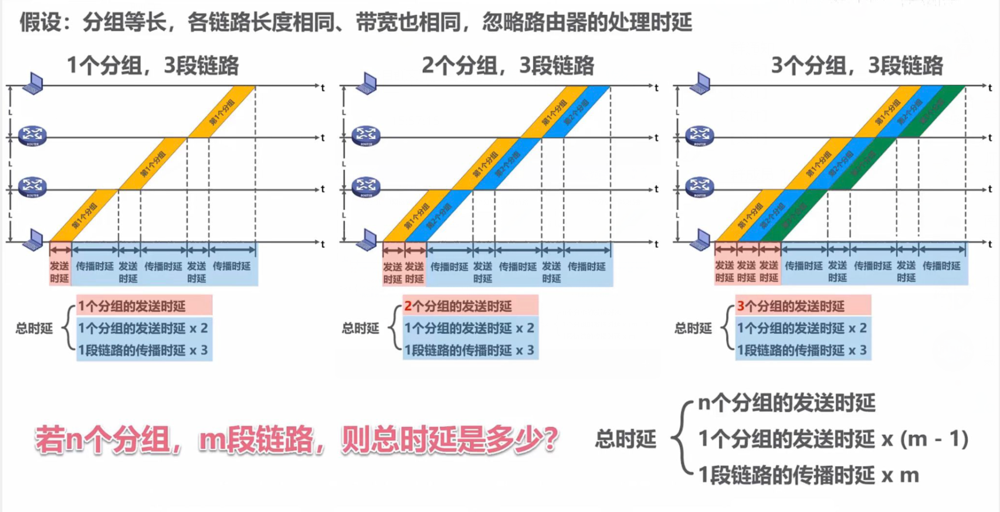

#### 应用层常用协议熟知端口号

| 协议  | 端口号 | 备注 |
| ----- | ------ | ---- |
| RIP   | 520    | UDP  |
| DNS   | 53     | UDP  |
| TFTP  | 69     | UDP  |
| SNMP  | 161    | UDP  |
| DHCP  | 67/68  | UDP  |
|       |        |      |
| SMTP  | 25     | TCP  |
| FTP   | 21/20  | TCP  |
| BGP   | 179    | TCP  |
| HTTP  | 80     | TCP  |
| HTTPS | 443    | TCP  |

+ 上述端口号用来标志某协议**服务器上的进程**，即客户端数据报首部中的**目的端口号**
+ 不管传输层用TCP还是UDP，网络层都要用IP封装成IP数据报
+ IP数据报首部中用协议字段区分是TCP还是UDP数据报（UDP:17, TCP:6)

#### 分组计算时延

