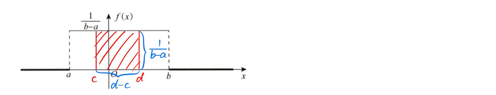
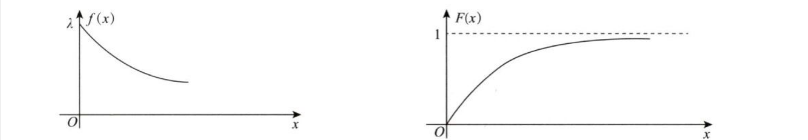
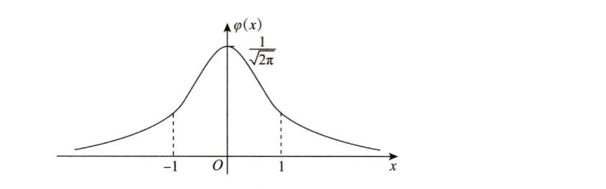
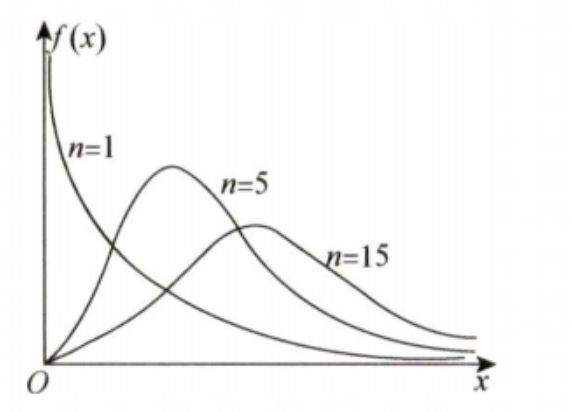
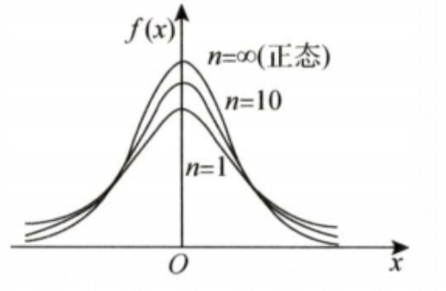
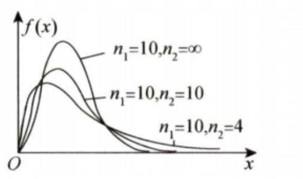
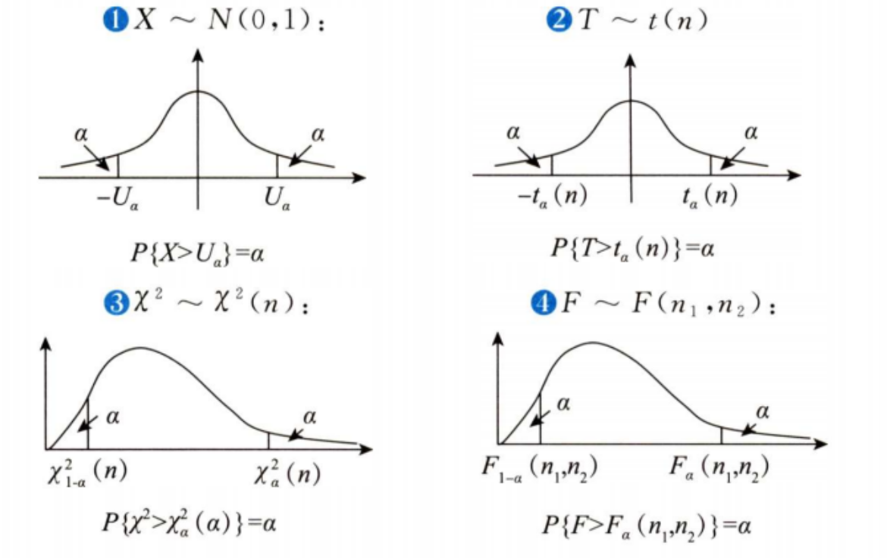
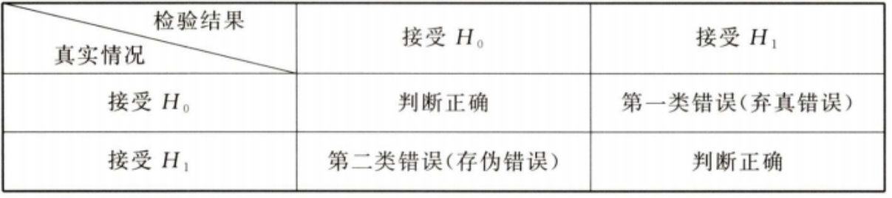
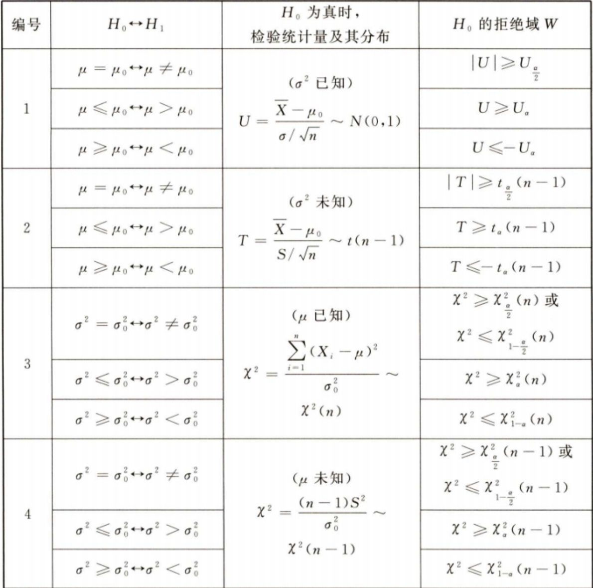
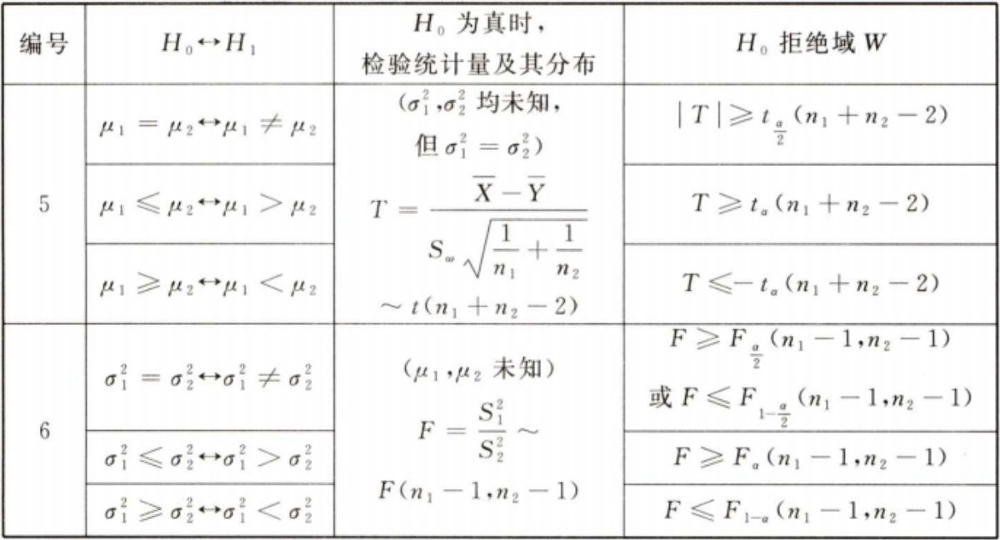

# 笔记

### 独立和互斥

#### 概念

1. 独立是**没有任何影响，毫无关系**
2. 互斥指**排斥**，你发生我就不能发生，两者是**有影响**的
3. 独立两者可以同时发生，排斥不能同时发生
4. 独立和互斥两者不能互推

数学语言：

1. $P(AB) = P(A)P(B)$,称AB独立

2. $P(AB)=0\Larr$AB互斥$\Lrarr AB = \phi$

3. $P(AB)=0\not\Rarr AB互斥$

   $例：A=x\le\frac{1}{2},B=x\ge\frac{1}{2},P(AB)=P(x=\frac{1}{2})=0,A\cap B\ne \phi$（连续性随机变量取到任何一个点的概率都是0）

   

#### 两者关系

##### 互斥不独立，独立不互斥

+ 由于互斥是有影响的，独立无影响，因此两者只能存在一个

+ 理解：有你没我，有我没你，因此你我之间有紧密联系；

  你我独立说明互相不认识，没有任何关系。

+ 前提是两者都不是不可能事件（不可能事件与任何事件都互斥且独立）

### 常见分布

#### 一、离散

##### (1)二项分布$B(n, p)$

+ 投篮投进概率是p，投n次，$P\{x=k\}$为**投进k次的概率**
+ $P\{x=k\}=C_n^kp^k(1-p)^{n-k}，k=0,1,2,...,n$
+ $EX=np, DX=np(1-p)$
+ $n=1$时为0-1分布

##### (2)泊松分布$P(\lambda)$

+ $P\{x=k\} =\frac{\lambda^k}{k!}e^{-\lambda},k=0,1,2,...,\lambda>0$
+ $EX=DX=\lambda$
+ 由级数$\Sigma^{+\infty}_{k=0}\frac{x^k}{k!}=1+x+\frac{x^2}{2!}+...=e^x$可知，$P\{x=k\}即此级数中第k项占整体的比例$

##### (3)几何分布

+ 一直投篮直到命中为止，$P\{x=k\}$为**一共投了k次的概率**
+ $P\{x=k\}=(1-p)^{k-1}p, k=1,2,3,..$
+ $EX=\frac{1}{p}, DX=\frac{1-p}{p^2}$（会推导）

#### 二、连续

##### (4)均匀分布$U(a, b)$

+ $f(x)=\begin{cases} \frac{1}{b-a}, a<x<b \\ 0, 其他 \end{cases}$
+ $EX=\frac{a+b}{2},DX=\frac{(b-a)^2}{12}$

+ $F(x)=\int_{-\infty}^xf(x)dx=\int_{a}^xf(x)dx=\frac{x-a}{b-a},a<x<b$
+ $若[c,d]\subset (a,b),则P\{c<x<d\}=\frac{d-c}{b-a}(长度之比)$

##### (5)指数分布$E(\lambda)$

+ $f(x)=\begin{cases} \lambda e^{-\lambda x}, x>0 \\ 0, 其他 \end{cases},\lambda>0$
+ $F(x)=\begin{cases}0, x<0 \\ 1-e^{-\lambda x}, x\ge0\end{cases}$
+ $EX=\frac{1}{\lambda}(均值为\frac{1}{\lambda}或参数为\lambda), DX=\frac{1}{\lambda^2}$
+ 背景：寿命
+ **无记忆性**：$P\{X>s+t|X>s\}=P\{X>t\}$
  $P\{已经活了60岁，再活30岁\}=P\{从出生开始活30岁\}$

##### (6)正态分布$N(\mu,\sigma^2)$

+ $f(x)=\frac{1}{\sqrt{2\pi}\sigma}e^{-\frac{(x-\mu)^2}{2\sigma^2}},x\in R$
+ 分布函数积不出
+ $EX=\mu,DX=\sigma^2$

$\frac{x-\mu}{\sigma}\sim N(0,1)为标准正态分布$（标准化）

+ $\varphi(x)=\frac{1}{\sqrt{2\pi}}e^{-\frac{x^2}{2}}$
+ $\Phi(0)=\frac{1}{2},\Phi(1)=0.841,\Phi(1.645)=0.95,\Phi(1.96)=0.975$
+ $\Phi(-x)=1-\Phi(x)$
+ $\varphi(x)积不出，但\Phi^{'}(x)=\varphi(x)$
+ $EX=\int_{-\infty}^{+\infty}x\varphi(x)dx=0(x\varphi(x)为奇函数)$

记：$\Phi(1)=0.8413;\quad\Phi(1.645)=0.95;\quad\Phi(1.96)=0.975$

##### (7)二维正态分布$N(\mu_1,\mu_2,\sigma_1^2,\sigma_2^2,\rho)$

1. $f(x,y) = \frac{1}{\sqrt{2\pi}\sigma_1\sqrt{2\pi}\sigma_2\sqrt{1-\rho^2}}e^{-u},u=\frac{1}{1-\rho^2}[\frac{(x-\mu_1^2)}{2\sigma_1^2}-\rho\frac{x-\mu_1}{\sigma_1}\frac{y-\mu_2}{\sigma_2}+\frac{(y-\mu_2)^2}{2\sigma_2^2}]$
2. $X\sim N(\mu_1,\sigma_1^2),Y\sim N(\mu_2,\sigma_2^2)$
3. $\rho是X与Y的相关系数，即\rho=\frac{Cov\{X,Y\}}{\sqrt{DX}\sqrt{DY}}=\frac{Cov\{X,Y\}}{\sigma_1\sigma_2}$
   $其中|\rho|<1$
4. X、Y的条件分布都是正态分布
5. $aX+bY(a\ne0,b\ne0)$服从正态分布
6. **X、Y独立的充要条件是X与Y不相关**，即$\rho=0$
   此时$f(x,y)=\frac{1}{\sqrt{2\pi}\sigma_1}e^{-\frac{(x-\mu_1)^2}{2\sigma_1^2}}\frac{1}{\sqrt{2\pi}\sigma_2}e^{-\frac{(x-\mu_2)^2}{2\sigma_2^2}}$

##### (8)二维均匀分布

+ $f(x,y)=\begin{cases} \frac{1}{S_G}(面积倒数), (x,y)\in G\\ 0, 其他 \end{cases}$
+ 概率**直接算面积之比**

### 数字特征公式

#### 1. 期望和方差

##### 求期望方法

+ 期望=函数值*概率的均值

+ $一维:Eg(X)=\sum g(x_i)p_i$

  ​			$Eg(X)=\int_{-\infty}^{+\infty}g(x)f(x)dx$

  特别地, $EX=\int_{-\infty}^{+\infty}xf(x)dx$

+ **二维：二维变量没有期望，但二维变量的函数有期望(一维)!!!**

  $EZ=Eg(X,Y)=\sum\sum g(x_i,y_i)p_{ij}$
  $EZ=Eg(X,Y)=\int_{-\infty}^{+\infty}\int_{-\infty}^{+\infty}g(x,y)f(x,y)dxdy$

+ ==特别地，$EX=\int_{-\infty}^{+\infty}\int_{-\infty}^{+\infty}xf(x,y)dxdy$（由二维密度求边缘期望）==

  $f_X(x)=\int_{-\infty}^{+\infty}f(x,y)dy$

  $EX=\int_{-\infty}^{+\infty}f_X(x)dx=\int_{-\infty}^{+\infty}\int_{-\infty}^{+\infty}xf(x,y)dxdy$

#### 2. 协方差和相关系数

##### 协方差

1. $Cov(X,Y)=E[(X-EX)(Y-EY)]=EXY-EXEY$
2. $Cov(X,X)=DX$
3. $若X、Y独立，则Cov(X,Y)=0$
4. $D(aX+bY)=D(aX)+D(bY)+2Cov(aX,bY)=a^2DX+b^2DY+2ab\rho_{XY}\sqrt{DX}\sqrt{DY}$

##### 相关系数

1. $\rho_{XY}=Cov(\frac{X-EX}{\sqrt{DX}},\frac{Y-EY}{\sqrt{DY}})=\frac{Cov(X,Y)}{\sqrt{DX}\sqrt{DY}}=\frac{EXY-EXEY}{\sqrt{DX}\sqrt{DY}}$

#### 3. 独立和不相关

##### $若X,Y独立，则$

1. $EXY=EX\dotproduct EY$
2. $D(X\pm Y)=DX+DY$
3. $Cov(X,Y)=0$
4. $\rho_{XY}=0$

##### 不相关的充分必要条件

1. $X,Y不相关，即\rho_{XY}=0$
2. $\Lrarr Cov(X,Y)=0$
3. $\Lrarr EXY=EX\dotproduct EY$
4. $\Lrarr D(X\pm Y)=DX+DY$
5. ==X,Y无线性关系==

##### 两者关系

1. 独立是没有任何关系，而不相关是没有线性关系
   因此独立一定不相关
2. 不相关不一定独立（**没有线性关系也可能有其他关系**）
3. $\rho\ne0\Rarr 不独立$（$\rho\ne0$表示有一点线性关系，那必然不独立）
4. 对于**二维正态分布**，$独立\Lrarr \rho=0\Lrarr 不相关$（只可能是线性关系）

### 卷积公式

**$原理:将X,Y的密度转换成X和Z(或Y和Z)的密度,再用边缘密度的公式求出Z的边缘密度$**

**$证明方法:通过暴力求导公式\frac{d}{dz}\int^{\beta(z)}_{\alpha(z)}G(z,x)dx=\int^{\beta(z)}_{\alpha(z)}G^{'}(z,x)dx+G(z,\beta(z))\beta^{'}(z)-G(z,\alpha(z))\alpha^{'}(z)$**

> 下面只转换成X和Z的密度

#### 1. $Z=X+Y$

> $y=z-x,\quad |y^{'}_z|=1$

+ $f_Z(z)=\int_{-\infty}^{+\infty}f(x,z-x)dx$
+ $已知f(x,y)时,只需将y换成z-x就能得到Z的概率密度$
+ $注意x,y的范围也要改成x,z的范围,并化简$

##### 计算步骤

1. $f(x,y)改写成f(x,z)$

1. $讨论z的范围$

2. $定x的限: 画z=z的直线,在取值范围内穿进穿出的点就是x的上下限$

   **只要看穿进穿出的点，不是二重积分看面积！！！！      ！！**

   > 例题：讲义P128 13题

#### 2. $Z=X\dotproduct Y$

> $y=\frac{z}{x},\quad |y^{'}_z|=\frac{1}{|x|}$

+ $f_Z(z)=\int_{-\infty}^{+\infty}f(x,\frac{z}{x})\frac{1}{|x|}dx$

#### 3. $Z=\frac{Y}{X}$

> $y=xz,\quad |y^{'}_z|=|x|$

+ $f_Z(z)=\int_{-\infty}^{+\infty}f(x,{z}{x})|x|dx$
+ 例题:讲义P128 14题

#### 4. $Z=\frac{X}{Y}$

> $y=\frac{x}{z}, |y^{'}_z|=\frac{|x|}{z^2}$

+ $f_Z(z)=\int_{-\infty}^{+\infty}f(x,\frac{x}{z})\frac{|x|}{z^2}dx$
+ 880基础解答6

### 易混淆

##### （1）边缘密度$f(x)$和边缘分布$F(x)$

只讨论连续型——只有连续型才讨论密度

1. $f_X(x)=\int^{+\infty}_{-\infty}f(x,y)dy,f_Y(y)=\int^{+\infty}_{-\infty}f(x,y)dx$（固定一个，累加另一个所有取值）
2. 若X,Y独立，则$f(x,y)=f_X(x)f_Y(y) \Lrarr f_{X|Y}(x|y)=f_X(x)$
3. $F_X(x)=P\{X\le x, Y\le +\infty \} = \lim_{y\rarr\infty}F(x,y)$
4. 若X,Y独立，则$F(x,y)=F_X(x)F_Y(y)$

### 特殊古典概型

##### 某事件第i次发生的概率为$p_i$,问前n次中平均发生了多少次？（期望）

+ 将每次的概率全部累加即得到期望

+ 证明:

  $记X_n为前n次发生的次数,Y_i为第i次发生的次数,则Y_i\sim\begin{vmatrix}0 & 1 \\1-p_i & p_i\end{vmatrix},EY_i=p_i$

  $且X_n=Y_1+Y_2+...+Y_n,则EX_n=EY_1+EY_2+...+EY_n=\sum p_i$

### 什么是参数估计

> 参数估计分为点估计和矩估计

#### 点估计

+ 例如估计国家线是60分
+ 点估计常用方法：矩估计法、最大/极大似然估计法、最小二乘法、贝叶斯估计法
+ 点估计能明确告知人们“未知参数是多少”，而不能反应估计的可信程度

##### 矩估计（methods of moments）

+ 原理是**用样本矩作为相应的总体矩**来求出估计量
+ 相比于最大似然估计、最小二乘法，效率很低，目前很少使用

#### 区间估计

+ 例如估计国家线是50~70分区间内
+ 依据抽取的样本，根据一定的正确度和精确度的要求，构造适当的区间，作为总体分布的未知参数或参数
  函数的真值所在范围的估计
+ 根据给定的概率值估计出来一个区间，这个区间称为**置信区间**，给定概率值称为**置信度或置信水平**
+ 置信水平就是实际落在置信区间的信心

#每章概念

### 第一章 概率

1. 概率中$A^2=AA=A\cap A=A,即P(A^2)=P(A)$

2. 多个事件相互独立，**只要字母不重叠**，经过任意运算后都独立

   例：A、B、C相互独立，A-C和B-C不独立，而A-B与C独立

### 第二章 一维r.v.

+ 由分布函数求某一点的密度（离散）:
  $P\{X=x_0\}=P\{X\le x_0\}-P\{X<x_0\}=F\{x_0\}-F\{x_0-0\}$
+ 只有连续型随机变量才有密度函数

##### 分布函数性质

1. **单调不减**（求参数判断取舍P97例2.2）
2. 取值0~1
3. 处处右连续

##### 概率密度性质（充要条件）

1. 非负
2. $\int_{-\infty}^{+\infty}f(x)dx=1$（规范性）

##### 分布函数和概率密度的组合

1. $F_1(x)F_2(x)一定是密度函数，是max\{F_1(x),F_2(x)\}的分布函数$
2. $a_1+a_2=1时，a_1F_1(x)+a_2F_2(x)一定是分布函数$
3. $a_1+a_2=1时，a_1f_1(x)+a_2f_2(x)一定是密度函数$

##### 记公式

1. $1+x+\frac{x^2}{2!}+...+\frac{x^n}{n!}+...=e^x$
2. $1+x+x^2+...+x^n+...=\frac{1}{1-x}$
3. $\int_0^{+\infty}x^ne^xdx=n!(n是自然数)$
4. $\int_{-\infty}^{+\infty}\frac{1}{\sqrt{2\pi}\sigma}e^{-\frac{(x-\mu)^2}{2\sigma^2}}dx=1(凑正态)$

##### 一维连续型

+ $X\sim f(x),分布函数为F(x)$
+ 取任一点的概率都是0
+ $P\{a<x<b\}=P\{a<x\le b\}=P\{a\le x<b\}=P\{a\le x\le b\}=F(b)-F(a)=\int_a^b f(x)dx(面积)$

##### 随机变量函数的分布

1. $求Y=g(X)的分布函数/概率密度$，首先应该画图！！**（把X做自变量，不用管X是什么）**
2. $画直线Y=y,找出与图像相交的部分，下方的区域转换为X的范围(积分区间)，用X的概率密度计算,得到P\{Y\le y\}$

+ 结论：**$如果X的分布函数F(x)是连续函数，则有Y=F(X)\sim U(0,1)$**

### 第三章 二维r.v.

#### 二维离散型

+ 离散型变量一般研究分布函数

##### 边缘分布

+ $F_X(x)=P\{X\le x, Y\le +\infty \} = \lim_{y\rarr\infty}F(x,y)$
+ 已知边缘分布，得不到联合分布
+ 求边缘概率即固定一行，累加求和

#### 二维连续型

+ 连续型变量一般研究概率密度，而不是概率分布

##### 边缘密度和边缘分布

+ $f_X(x)=\int^{+\infty}_{-\infty}f(x,y)dy,f_Y(y)=\int^{+\infty}_{-\infty}f(x,y)dx$（固定一个，累加另一个所有取值）
  **注意是$f不是F!!!$**
+ 若X,Y独立，则$f(x,y)=f_X(x)f_Y(y) \Lrarr f_{X|Y}(x|y)=f_X(x)$
+ $F_X(x)=P\{X\le x, Y\le +\infty \} = \lim_{y\rarr\infty}F(x,y)$
+ 若X,Y独立，则$F(x,y)=F_X(x)F_Y(y)$

##### 由概率密度求概率分布

+ $F(x,y)=\int_{-\infty}^x\int_{-\infty}^y f(u,v)dudv$，表示点**落在(x,y)左下方矩形区域**的概率

##### 独立性

若X,Y独立，则

1. $f(x,y)=f_X(x)f_Y(y)$
2. $F(x,y)=F_X(x)F_Y(y)$

#### (离，连)型求概率

将离散型的取值视为**完备事件组**，接着用**全概公式**

### 第四章 数字特征

#### 数学期望$EX$

##### 求期望的两个思路

1. 用自己的分布求
   先求出自己的概率密度，再用定义求期望
2. 用别人的分布求
   $EXY=\begin{cases} \sum_j\sum_ix_iy_jP\{X=x_i,Y=y_i\}\\\int_{-\infty}^{+\infty}\int_{-\infty}^{+\infty}xyf(x,y)dxdy \end{cases}$
   ==**直接用函数值*自变量概率求和/积分**==

##### 期望性质

1. 期望即**均值**

2. 常数的期望为常数（**EX本身也是常数**）

3. 期望有**线性性质**
   $E(ax+b)=aEX+b$
   $E(X\pm Y)=EX\pm EY$

4. $E(XY)=EX\dotproduct EY \Lrarr X,Y不相关$**（不相关的充要条件）**

5. **独立能推出不相关，不相关推不出独立**

   **独立是没有任何关系，而不相关是没有线性关系！！！**

6. $X\ge a,则EX\ge a$

##### 求$U=max(X,Y),V=min(X,Y)$的期望

1. 可以用(X,Y)的分布求，
2. 求出U、V各自的分布后用定义求期望
3. 特殊方法：

+ $U=max(X,Y)=\frac{X+Y+|X-Y|}{2},V=min(X,Y)=\frac{X+Y-|X-Y|}{2}$

+ $U+V=X+Y,U-V=|X-Y|,U\times V=X\times Y$

+ $EU+EV=EX+EY,EU-EV=E|X-Y|,联立求得EU和EV$

  

$若X_1,X_2,...X_n独立同分布,X_i\sim F(x),如何求U=max(X_1,X_2,...,X_n)和V=min(X_1,X_2,...X_n)的期望？$

+ ==**只能先求各自的分布函数，再用定义求期望**==
+ $F_U(x)=F^n(x);F_V(x)=1-[1-F(x)]^n$
+ $EU=\int_{-\infty}^{+\infty}uf_U(u)du=\int_{-\infty}^{+\infty}xf_U(x)dx$

#### 方差$DX$

##### 定义

+ $DX=E[X-EX]^2>0,\sqrt{DX}称标准差$
+ $DX=E[X-EX]^2=E[X^2-2EX\dotproduct X+(EX)^2]=EX^2-2EX\dotproduct EX+(EX)^2=EX^2-(EX)^2$
+ $EX^2>(EX)^2$（**显然：平方的均值大于均值的平方**）

##### 计算

1. $DX=EX^2-(EX)^2$
2. $EX^2=DX+(EX)^2$（结合常见分布)
   例如，见到$\int^{+\infty}_{-\infty}x^2e^{-x^2}dx$，想到凑出正态分布，利用某正态分布的方差和均值算此积分

##### 性质

1. 方差反应随机变量**对中心位置的偏移**
2. $D(C)=0$(常数没有偏移)
3. $D(aX+b)=D(aX)=a^2DX,\quad D(-X)=DX$
   $D|X|=EX^2-(E|X|)^2\ne DX$
4. $X,Y独立\rarr D(X\pm Y)=DX+DY\Lrarr X,Y不相关$
5. $D(aX+bY)=\begin{cases}a^2DX+b^2DY+2cov(aX,bY) \\E(aX+bY)^2-(E(aX+bY))^2 \end{cases}$

#### 协方差$Cov(X,Y)$

##### 定义

+ $Cov(X,Y)=E[(X-EX)(Y-EY)]$
+ $Cov(X,X)=DX$

##### 计算

+ $Cov(X,Y)=EXY-EX\dotproduct EY$
+ $Cov(X,Y)=\rho_{XY}\sqrt{DX}\sqrt{DY}$
+ $Cov(X,-Y)=-Cov(X,Y)$

##### 性质

1. $Cov(X,Y)=Cov(Y,X)$
2. $Cov(aX,bY)=abCov(X,Y)$
3. $Cov(X_1+X_2,Y)=Cov(X_1,Y)+Cov(X_2,Y)$
4. **独立**则协方差为0（$\rho=0$）
5. $D(aX+bY)=D(aX)+D(bY)+2Cov(aX,bY)=a^2DX+b^2DY+2ab\rho_{XY}\sqrt{DX}\sqrt{DY}$

#### 相关系数$\rho$

##### 定义

+ $\rho_{XY}=Cov(\frac{X-EX}{\sqrt{DX}},\frac{Y-EY}{\sqrt{DY}})=\frac{Cov(X,Y)}{\sqrt{DX}\sqrt{DY}}=\frac{EXY-EXEY}{\sqrt{DX}\sqrt{DY}}$

##### 性质

1. $|\rho_{XY}|\le 1$
2. $\rho_{XY}=0$，称**XY不相关**==（无线性关系）==
3. $|\rho_{XY}|=1\Lrarr P\{Y=aX+b,a\ne 0\}=1$（X,Y是线性关系)
   $a<0\Rarr \rho=-1;a>0\Rarr\rho=-1$
4. 相关系数表示X,Y**线性关系的紧密程度**

#### 独立和不相关判定

##### 不相关的等价说法

+ $X,Y不相关，即\rho_{XY}=0$

+ $\Lrarr Cov(X,Y)=0$
+ $\Lrarr EXY=EX\dotproduct EY$
+ $\Lrarr D(X\pm Y)=DX+DY$
+ ==X,Y无线性关系==

##### 判断不独立

+ 只需要找一个点，说明$PXPY\ne PXY$
+ 对于连续型，已知联合密度，只要满足**取值为正矩形且密度可分离变量**，就独立

##### 两者关系

1. 独立是没有任何关系，则比没有线性关系
   因此独立$\Rarr$不相关
2. 不相关不一定独立（**没有线性关系也可能有其他关系**）
3. $\rho\ne0\Rarr 不独立$（$\rho\ne0$表示有一点线性关系，那必然不独立）
4. 对于**二维正态分布**，$独立\Lrarr \rho=0\Lrarr 不相关$（只可能是线性关系）

#### 正态分布的问题

##### 一维正态

1. $X\sim N(\mu,\sigma^2),则Y=aX+b\sim  N(a\mu+b,a^2\sigma^2)$
2. **独立**正态的**线性**组合仍是正态分布(加常数也是线性组合)
   $aX+bY+C\sim N(a\mu_1+b\mu_2+C,a^2\sigma_1^2+b^2\sigma_2^2)$
   + **注意必须要独立**
   + 例如X,Y服从正态，但X=-Y,此时X+Y=0（常数）不符合正态分布

##### 二维正态$N(\mu_1,\mu_2,\sigma_1^2,\sigma_2^2,\rho)$

会写概率密度$f(x,y) = \frac{1}{\sqrt{2\pi}\sigma_1\sqrt{2\pi}\sigma_2\sqrt{1-\rho^2}}e^{-u},u=\frac{1}{1-\rho^2}[\frac{(x-\mu_1^2)}{2\sigma^2}-\rho\frac{x-\mu_1}{\sigma_1}\frac{y-\mu_2}{\sigma_2}+\frac{(y-\mu_2)^2}{2\sigma_2^2}]$

1. $X\sim N(\mu_1,\sigma_1^2),Y\sim N(\mu_2,\sigma_2^2),|\rho|<1$

   $X,Y独立\Lrarr \rho=0\Lrarr X,Y不相关$

2. $aX+bY\sim N(a\mu_1+b\mu_2,a^2\sigma_1^2+b^2\sigma_2^2+2ab\rho\sigma_2\sigma_2)$

   + **X,Y不需要独立！！**

3. 对于$\begin{cases}U=a_1X+b_1Y \\ V=a_2X+b_2Y\end{cases}$,当$\begin{vmatrix}a_1 & b_1 \\a_2 & b_2\end{vmatrix}\ne0时,(U,V)仍服从二维正态$

   + 可逆线性变换把X,Y的关系传递给了U,V
   + 如$(X+Y,X-Y)服从二维正态$
   + **相关系数可能会变!!!!!**

4. $X正态,Y正态,且X,Y独立\Rarr(X,Y)服从二维正态,其中\rho=0$
   $X正态,Y正态,但X,Y不独立\not\Rarr (X,Y)服从二维正态！！！$
   $X正态,Y正态,X,Y不相关(\rho=0),同样推不出(X,Y)服从二维正态！！！$

   > **不相关推不出独立，也推不出二维正态**

#### 求$EXY$

##### 方法：转换成随机变量函数的期望

+ $Y=g(X)\Rarr EXY=E(Xg(X))=\int_{-\infty}^{+\infty}xg(x)dx$

##### 1. $X、Y都是连续型$

+ 直接带进积分

##### 2. （离、连）型——讲义P147例4.14

+ **根据Y关于X的取值，将积分分段**

### 第五章 大数定律与中心极限定理

#### 1. 切比雪夫不等式

+ $P\{|x-EX|\ge \varepsilon\}\le\frac{\sigma^2}{\varepsilon^2}$
  $P\{|x-EX|< \varepsilon\}\ge1-\frac{\sigma^2}{\varepsilon^2}$
+ **注意有绝对值！！！**
+ 越靠近均值，概率越大
+ 只能用于估计概率，不能精确计算

#### 2. 大数定律

##### 依概率收敛

+ 序列$Y_1,Y_2,...,Y_n$依概率收敛于a,即**Y在a附近取值**
+ 频率（实际）依概率收敛与期望（理论）
+ **性质：$X_n\rarr a, Y_n\rarr b,则X_n,Y_n的函数g(X_n,Y_n)\rarr g(a,b)$**

##### 各种大数定律

+ 一句话：==**算术平均依概率收敛于期望**==(很大概率在期望附近取值)
+ 例：$\frac{1}{n}\Sigma^n_{i=1} X_i^2-(\frac{1}{n}\Sigma_{i=1}^n X_i)^2依概率收敛于EX_i^2-(EX_i)^2$

#### 3. 中心极限定理

+ 记一句话：大量r.v的和（近似）服从正态分布
+ 只需要算出期望和方差，就可以当成正态分布来做题

### 第六章 数理统计概念

#### 一、总体和样本

看到$X_1,X_2,...X_n是来自总体X的容量为n的简单随机样本,应想到:$

1. $X_1,X_2,...X_n相互独立$
2. $X_1,X_2,...,X_n同分布$（同分布不是相等）
   但期望和方差相等：$EX_i=\mu=E(\frac{1}{n}\sum X_i), DX_i=\sigma^2=D(\sum X_i)/n$

##### 统计量

+ 指样本$X_1,X_2,...,X_n$==不含总体任何未知参数==的函数$g(X_1,X_2,...,X_n)$
+ 例：若总体$X\sim N(\mu, \sigma^2)$，其中$\mu$已知，**$\sigma^2$未知**，则
  1. $maxX_i-\mu是统计量$
  2. $\frac{1}{\sigma^2}\sum(X_i-\mu)^2不是统计量$

##### 样本均值$\overline{X}和样本方差S^2$

+ 样本均值$\overline{X}=\frac{1}{n}\sum X_i$
+ 样本方差$S^2=\frac{1}{n-1}\sum(X_i-\overline{X})^2=\frac{1}{n-1}(\sum X_i^2-n\overline{X}^2)$

##### 记公式

$总体X,期望EX=\mu,方差DX=\sigma^2$

1. $E\overline{X}=\mu,D\overline{X}=\frac{\sigma^2}{n}$
2. $ES^2=\sigma^2,E\sum(X_i-\overline{X})^2=(n-1)ES^2=(n-1)\sigma^2$
3. $DS^2=\frac{2\sigma^4}{n-1}$
   + 由$\frac{(n-1)S^2}{\sigma^2}\sim\chi^2(n-1)$得
   + $D\frac{(n-1)S^2}{\sigma^2}=\frac{(n-1)^2}{\sigma^4}DS^2=2(n-1)$

#### 二、三大分布

> 考试要求：记住构造、性质、会画密度草图（密度表达式不考）

##### 1. 卡方分布$\chi^2$

+ 构造：$X_1,X_2,X_n独立同分布\sim N(0,1)$

​			 				$\chi^2=X_1^2+X_2^2+...+X_n^2\sim\chi^2(n), n称为自由度$——==$\chi^2符号是一个整体$！！！==

+ 性质：
  $(1)X\sim N(0,1),则X^2\sim\chi^2(1);EX^2=1, DX^2=2$

  $(2)\chi^2\sim\chi^2(n),则E\chi^2=n,D\chi^2=2n$

  $(3)可加性:\chi_1^2\sim\chi_1^2(n_1),\chi_2^2\sim\chi_2^2(n_2),且\chi_1^2,\chi_2^2独立,则\chi_1^2+\chi_2^2\sim\chi^2(n_1+n_2)$

+ 密度图

   

  + 平方和>0，因此只在第一象限取值

##### 2. t分布（student分布）

+ 构造：$X\sim N(0,1), Y\sim \chi^2(n),X,Y独立$
  		则$T=\frac{X}{\sqrt\frac{Y}{n}}\sim t(n)$
+ 性质：$T\sim t(n),则T^2=\frac{X^2}{Y/n}\sim F(1,n);\frac{1}{T^2}\sim F(n,1)$
+ 密度图
  

##### 3. F分布

+ 构造：$X\sim\chi^2(n),Y\sim\chi^2(n),X,Y独立$
  		$F=\frac{X/n_1}{Y/n_2}\sim F(n_1,n_2)$
+ 性质：$F\sim F(n_1,n_2),则\frac{1}{F}\sim F(n_2,n_1)$
+ 密度图
  

##### 4. 上侧$\alpha$分位点$(0<\alpha<1)$

> 适用标准正态$N(0,1)、卡方\chi(n)、t分布和F分布$

$设U\sim N(0,1),对于给定正数\alpha, 0<\alpha < 1, 称满足P\{U\ge U_\alpha\}=\alpha的点为N(0,1)的上侧\alpha分位点$

+ $U\alpha取值与\alpha有关，因此用下标\alpha来标记(点U_\alpha指该点右边面积为\alpha)$
+ 一般通过查表来得到$U_\alpha$的值
+ $\alpha与n没关系,n决定分布函数,\alpha是人为选取的正数$

1. 对于标准正态:$\Phi(U_\alpha)=P\{X\le U_\alpha\}=1-\alpha$
   例：$\Phi(1.645)=0.95,则U_{0.05}=1.645.(1.645左边面积是0.95,则右边面积就是0.05,即1.645就是U_{0.05})$
   + $U_{1-\alpha}=-U_\alpha$
2. 对于t分布$T\sim t(n),P\{T>t_\alpha(n)\}=\alpha$
   + 与$N(0,1)类似,概率密度都是偶函数\Rarr t_{1-\alpha}=-t_\alpha$
3. 对于卡方分布$\chi^2\sim\chi^2(n),P\{\chi^2>\chi_\alpha^2(n)\}=\alpha$
   + 密度函数不对称，因此$\chi_{1-\alpha}^2与\chi_\alpha^2没有对应表达式$
   + $由图易知P\{\chi^2_{1-\alpha}<\chi^2<\chi^2_{\alpha}\}=1-2\alpha$
4. 对于F分布$F\sim F(n_1,n_2), P\{F>F_\alpha(n_1,n_2)\}=\alpha$
   + ==$F_{1-\alpha}(n_1,n_2)=\frac{1}{F_\alpha(n_2,n_1)}$==

==重要结论：$\chi_\alpha^2(1)=U^2_{\frac{\alpha}{2}};F_\alpha(1,n)=t^2_{\frac{\alpha}{2}}(n)$==

1. $X\sim t(n), X^2\sim F(1,n).$
   $P\{X>t_\frac{\alpha}{2}\}=\frac{\alpha}{2},P\{X^2>F_\alpha\}=\alpha,记t_\frac{\alpha}{2}=c$
   $则P\{X^2>c^2\}=P\{X>c\}+P\{X<-c\}=\alpha=P\{X^2>F_\alpha\}$
   $于是c^2=F_\alpha=t^2_\frac{\alpha}{2}=c^2$
2. $X\sim N(0,1), X^2\sim\chi^2(1)$
   $记c=U\frac{\alpha}{2},P\{X^2>c^2\}=P\{X>c\}+P\{X<-c\}=\alpha=P\{X^2>\chi^2_\alpha\}$
   $于是c^2=\chi^2_\alpha=U^2_\frac{\alpha}{2}$

#### 三、单正态总体下样本均值与样本方差的分布

总体$X\sim N(\mu, \sigma^2),X_1,X_2,...,X_n为样本.\overline{X}=\frac{1}{n}\sum X_i,S^2=\frac{1}{n-1}\sum(X_i-\overline{X})^2$
$记S_*^2=\frac{1}{n}\sum(X_i-\overline{X})^2$
$E\overline{X}=\mu,D\overline{X}=\frac{\sigma^2}{n};ES^2=\sigma^2$

##### 结论1：样本均值的分布

由于独立正态的线性组合仍是正态分布，则$\overline{X}\sim N(\mu, \frac{\sigma^2}{n})$

+ $\frac{\overline{X}-\mu}{\sigma/\sqrt{n}}\sim N(0,1)$
+ $(\frac{\overline{X}-\mu}{\sigma/\sqrt{n}})^2\sim \chi^2(1)$

##### 结论2：样本与总体均值$\mu$

由$\frac{X_i-\mu}{\sigma}\sim N(0,1),则\frac{(X_i-\mu)^2}{\sigma^2}\sim \chi^2(1),于是$

+ $\frac{\sum(X_i-\mu)^2}{\sigma^2}\sim \chi^2(n)$

##### 结论3：样本方差的分布

+ $\frac{\sum(X_i-\overline{X})^2}{\sigma^2}=\frac{(n-1)S^2}{\sigma^2}=\frac{nS_*^2}{\sigma^2}\sim\chi^2(n-1)$(**注意自由度是n-1不是n**)
+ $i=n时,X_1-\overline{X}+X_2-\overline{X}+...+X_n-\overline{X}=0，因此只有n-1个随机变量$
+ 无法证明

##### 结论4：样本均值与样本方差

+ $\frac{\overline{X}-\mu}{S/\sqrt{n}}\sim t(n-1);(\frac{\overline{X}-\mu}{S/\sqrt{n}})^2\sim F(1, n-1)$
+ 特别地，$nS_*^2=(n-1)S^2\Rarr S_*^2/(n-1)=S^2/n,则\frac{\overline{X}-\mu}{S_*/\sqrt{n-1}}\sim t(n-1)$

##### 结论5：单正态总体下，$\overline{X}与S^2独立$

+ ==注意一定是正态总体==

### 第七章 参数估计

#### 一、矩估计

> 思想：用样本矩（实际）来估计总体矩（理论）

总体X，样本$X_1,X_2,...,X_n$

##### 1. 总体矩

+ $EX为X的一阶原点矩$
+ $EX^2为X的二阶原点矩$
+ $DX=E(X-EX)^2为X的二阶中心矩$

##### 2. 样本矩

+ $A_1=\overline{X}=\frac{1}{n}\sum X_i$为样本的一阶原点矩
+ $A_2=\frac{1}{n}\sum X_i^2$为样本的二阶原点矩
+ $B_2=S_*^2=\frac{1}{n}\sum (X_i-\overline{X})^2=\frac{1}{n}(\sum X_i^2-n\overline{X}^2)$为样本的二阶中心矩
  + ==$注意样本方差S^2=\frac{1}{n-1}\sum(X_i-\overline{X})^2不是矩,不能用于矩估计$==

##### 3. 关系

由大数定律：==算术平均依概率收敛于数学期望==

+ $A_1\rarr EX$
+ $A_2\rarr EX^2$
+ $B_2\rarr DX$
  + $EB_2=\frac{1}{n}(\sum EX_i^2-n(E\overline{X})^2)=EX^2-(EX)^2=DX$

##### 解题步骤

求θ的矩估计值

1. 列等式，解$\theta$（由低阶到高阶）——==θ和X一样，都是随机变量==
   + 一阶：$\overline{X}=EX$
   + 二阶：$\frac{1}{n}\sum X_i^2=EX^2$——==优先用原点矩！==
               $\frac{1}{n}(\sum X_i^2-n\overline{X}^2)=DX$==中心矩后用==
2. 考研只考过一阶

#### 二、最大似然估计

> 让似然函数取到最大值的估计
> 思想：在未知参数θ的取值范围内,让L(θ)取到最大值的$\hat{\theta}$作为θ的最大似然估计

##### 1. 似然函数

+ 样本$X_i$取到观测值$x_i$的概率$L(\theta)$,称为似然函数
+ $\theta$为待估参数
+ 对于离散型，$L(\theta)=P\{X_1=x_1,X_2=x_2,...,X_n=x_n\}=\prod P\{X_i=x_i\}$
+ 对于连续型，不能取到某个点，因此用取到邻域的概率代替
  $P\{X_1\in U(x_1), ..., X_n\in U(x_n)\}=f(x_1)\Delta x\dotproduct f(x_2)\Delta x...f(x_n)\Delta x$
  $由于f(x_i)与\theta有关,\Delta x与\theta无关,因此取L(\theta)=f(x_1;\theta)f(x_2;\theta)...f(x_n;\theta)$,==即$(X_1,X_2,...X_n)联合密度的观测值$==

##### 2. 大题步骤

1. 写$L(\theta)$
2. 取对数，求导，即令$\frac{d\ln L(\theta)}{d\theta}=0$
   解得驻点$\hat\theta$,即为θ的最大似然估计
3. 若没有驻点，即$L(\theta)单调\begin{cases}单调增:\theta的最大值是样本的最小值，即\hat\theta=min(X_1,X_2,...X_n)\\单调减:\theta的最大值是样本的最大值，即\hat\theta=max(X_1,X_2,...X_n)\end{cases}$
4. 估计量:用X
   估计值:用x

#### 三、估计量的评选标准

##### 1.无偏估计

+ $E\hat\theta=\theta,称\hat\theta为\theta的无偏估计$
+ $\lim_{n\rarr\infty}E\hat\theta=\theta,称\hat\theta为\theta的渐进无偏估计$

结论:

1. 无偏估计不唯一
2. $E\overline{X}=\mu\Rarr \overline{X}是\mu的无偏估计$
3. $ES^2=DX=\sigma^2\Rarr S^2是\sigma^2的无偏估计$

##### 2. 有效性

+ 多个无偏估计中，方差越小的越有效
+ **方差反应对中心位置的偏移**
+ 必须先是无偏估计，才能说有效性

##### 3. 一致性（相合性）

+ $\hat\theta依概率收敛于\theta,称\hat\theta是\theta的一致/相合估计量$

#### 四、区间估计

##### 求置信区间步骤

> 给定置信度1-$\alpha$,求未知参数$\theta$的置信区间（即求$\theta 有1-\alpha的概率在什么区间取值$）
> 置信区间的左右端点称为==置信下限和置信上限==

1. 选择一个概率密度函数$T(X_1,X_2,...,X_2,\theta)=T(\theta)(只有\theta一个未知参数)$
   + 根据什么参数未知选择对应的分布
2. 求$P\{a<T(\theta)<b\}=1-\alpha$
3. 将上式转化为$P\{\hat\theta_1<T(\theta)<\hat\theta_2\}=1-\alpha,即求得置信区间(\hat\theta_1,\hat\theta_2)$

##### 正态总体下$\mu,\sigma^2$的置信区间

1. $\sigma^2已知,求\mu的置信区间$——==T中可以出现σ==
   + 选$T(\mu)=\frac{\overline{X}-\mu}{\sigma/\sqrt{n}}\sim N(0,1)$
   + $P\{-U_{\frac{\alpha}{2}}<T(\mu)<U_{\frac{\alpha}{2}}\}$
   + 反解$\mu得置信区间(\overline{X}-U_{\frac{\alpha}{2}}\frac{\sigma}{\sqrt n},\overline{X}+U_{\frac{\alpha}{2}}\frac{\sigma}{\sqrt n})$
2. $\sigma^2未知,求\mu的置信区间$
   + 选$T(\mu)=\frac{\overline{X}-\mu}{S/\sqrt{n}}\sim t(n-1)$
3. $\mu已知,求\sigma^2的置信区间$——==T中可以出现μ==
   + 选$T(\mu)=\frac{\sum(X_i-\mu)^2}{\sigma^2}\sim \chi^2(n)$
4. $\mu未知,求\sigma^2的置信区间$
   + 选$T(\mu)=\frac{(n-1)S^2}{\sigma^2}\sim\chi^2(n-1)$

### 第八章 假设检验

#### 一、假设检验的概念

##### 1. 假设检验

+ 即先假设，再检验（抽样），并检验假设对不对

+ 依据——**小概率原理**：小概率事件在一次抽样下几乎不可能发生

##### 2. 两类错误

> 记$H_0$为优秀，$H_1$为不优秀

+ 第一类——弃真：实际上很优秀（真实情况的是$H_0$，假设了$H_0$），但检验时发挥失常（检验结果$H_1$），错认为不优秀（拒绝了$H_0$的假设）
+ 第二类——存伪：实际上很菜（真实情况的是$H_1$，假设了$H_1$），但检验时超常发挥（检验结果$H_0$），错认为优秀（$拒绝了H_1的假设$）

##### 3. 显著性检验

+ 无法同时使第一类和第二类错误概率都很小
+ 此时**总是控制第一类错误的概率（尽量不弃真）**
+ 使第一类错误的概率不大于给定的$\alpha$，这种检验就是显著性检验问题
+ $\alpha$称为**显著性水平**

##### 4. 假设检验的步骤

1. 提出原假设$H_0$，备择假设$H_1$
   + 带等号的做$H_0$
2. ==构建检验统计量==
3. 写出拒绝域W
   检验时，用一个统计量T作为检验统计量，T落在区域W时，就拒绝$H_0$的假设，这一区域W称为$H_0$的拒绝域。
   W的选取是通过控制第一类错误的概率$\alpha$来决定的。
4. 根据样本观测值，计算统计量，进行判断
   ==将假设的参数直接带入,计算得到统计量,判断是否落在接受域,如果落在了拒绝域,就拒绝==

#### 二、正态总体下的均值和方差的假设检验

> $X\sim N(\mu, \sigma^2), 要对\mu和\sigma^2进行假设和检验$

##### 1. 假设

+ 根据$\mu和\sigma^2已知和未知,以及假设检验的是\mu还是\sigma^2, 分为四种情况$
+ 即上述$\mu和\sigma^2$的置信区间四种情况

##### 2. 检验

+ 如下表

+ 带等号的为假设（$H_0$）

+ 对于$\mu$的假设检验：$\overline{X}依概率收敛与\mu,即\overline{X}很大概率在假设的\mu_0附近取值,而当\overline{X}的检验值离\mu_0太远,$

  $即\overline{X}落在了\mu_0的拒绝域,说明不正常,假设不对,应该拒绝当前的假设$

单正态总体：

双正态总体：

# 结论

#### 无记忆性

+ 几何分布和泊松分布都有无记忆性
+ $P\{X>m+n|X>n\}=P\{x>m\}$

#### 分布函数服从均匀分布

+ $随机变量X\sim F(x),则Y=F(x)\sim U(0,1)$

#### 极值分布

+ $M=max\{X_1,X_2,...X_k\},N=min\{X_1,X_2,...X_k\}$
+ $F_M(m)=[F_X(m)]^k,F_N(n)=1-[1-F_X(n)]^k$

#### 积分表

1. $\int_{-\infty}^{+\infty}e^{-\frac{x^2}{2}}dx=\sqrt{2\pi}$

   $\int_{-\infty}^{+\infty}xe^{-\frac{x^2}{2}}dx=0$

   $\int_{-\infty}^{+\infty}x^2e^{-\frac{x^2}{2}}dx=\sqrt{2\pi}$

   + $X\sim N(0,1),EX=1,EX^2=DX+(EX)^2=1+0=1$

2. $\int_{-\infty}^{+\infty}e^{-x^2}dx=\sqrt\pi$ 

   $\int_{-\infty}^{+\infty}xe^{-x^2}dx=0$

   $\int_{-\infty}^{+\infty}x^2e^{-x^2}dx=\frac{\sqrt\pi}{2}$

   + $X\sim N(0,\frac{1}{2}),EX=0,EX^2=DX+(EX)^2=\frac{1}{2}$

3. $\int_{-\infty}^{+\infty}e^{-|x|}dx=2\int_{0}^{+\infty}e^{-x}dx=2$

4. $\int_{-\infty}^{+\infty}e^{-a^2x^2}dx=\frac{\sqrt\pi}{a}$

#### 正态分布绝对值的期望方差

1. $X\sim N(0,1),则E|X|=\sqrt\frac{2}{\pi},D|X|=1-\frac{2}{\pi}$
2. $X\sim N(0,\sigma^2),则E|X|=\sqrt\frac{2}{\pi}\sigma,D|X|=(1-\frac{2}{\pi})\sigma^2$

#### 两点分布独立等价于不相关

+ $A、B为两随机事件,X=\begin{cases}p,A发生 \\ 1-p, A不发生\end{cases}\quad Y=\begin{cases}q,B发生 \\ 1-q, B不发生\end{cases}$
+ 则$X、Y不相关\Lrarr X、Y独立$