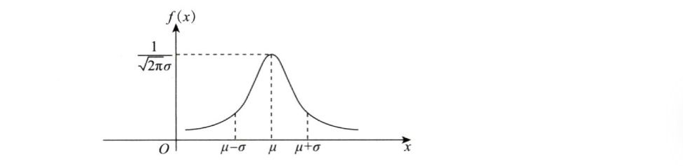

# 笔记

### 独立和互斥

#### 概念

1. 独立是**没有任何影响，毫无关系**
2. 互斥指**排斥**，你发生我就不能发生，两者是**有影响**的
3. 独立两者可以同时发生，排斥不能同时发生
4. 独立和互斥两者不能互推

数学语言：

1. $P(AB) = P(A)P(B)$,称AB独立

2. $P(AB)=0\Larr$AB互斥$\Lrarr AB = \phi$

3. $P(AB)=0\not\Rarr AB互斥$

   $例：A=x\le\frac{1}{2},B=x\ge\frac{1}{2},P(AB)=P(x=\frac{1}{2})=0,A\cap B\ne \phi$（连续性随机变量取到任何一个点的概率都是0）

   

#### 两者关系

##### 互斥不独立，独立不互斥

+ 由于互斥是有影响的，独立无影响，因此两者只能存在一个

+ 理解：有你没我，有我没你，因此你我之间有紧密联系；

  你我独立说明互相不认识，没有任何关系。

+ 前提是两者都不是不可能事件（不可能事件与任何事件都互斥且独立）

### 常见分布

#### 离散

##### (1)二项分布$B(n, p)$

+ 投篮投进概率是p，投n次，$P\{x=k\}$为**投进k次的概率**
+ $P\{x=k\}=C_n^kp^k(1-p)^{n-k}，k=0,1,2,...,n$
+ $EX=np, DX=np(1-p)$
+ $n=1$时为0-1分布

##### (2)泊松分布$P(\lambda)$

+ $P\{x=k\} =\frac{\lambda^k}{k!}e^{-\lambda},k=0,1,2,...,\lambda>0$
+ $EX=DX=\lambda$
+ 由级数$\Sigma^{+\infty}_{k=0}\frac{x^k}{k!}=1+x+\frac{x^2}{2!}+...=e^x$可知，$P\{x=k\}即此级数中第k项占整体的比例$

##### (3)几何分布

+ 一直投篮直到命中为止，$P\{x=k\}$为**一共投了k次的概率**
+ $P\{x=k\}=(1-p)^{k-1}p, k=1,2,3,..$
+ $EX=\frac{1}{p}, DX=\frac{1-p}{p^2}$（会推导）

#### 连续

##### (4)均匀分布$U(a, b)$

+ $f(x)=\begin{cases} \frac{1}{b-a}, a<x<b \\ 0, 其他 \end{cases}$
+ $EX=\frac{a+b}{2},DX=\frac{(b-a)^2}{12}$

+ $F(x)=\int_{-\infty}^xf(x)dx=\int_{a}^xf(x)dx=\frac{x-a}{b-a},a<x<b$
+ $若[c,d]\subset (a,b),则P\{c<x<d\}=\frac{d-c}{b-a}(长度之比)$

##### (5)指数分布$E(\lambda)$

+ $f(x)=\begin{cases} \lambda e^{-\lambda x}, x>0 \\ 0, 其他 \end{cases},\lambda>0$
+ $F(x)=\begin{cases}0, x<0 \\ 1-e^{-\lambda x}, x\ge0\end{cases}$
+ $EX=\frac{1}{\lambda}(均值为\frac{1}{\lambda}或参数为\lambda), DX=\frac{1}{\lambda^2}$
+ 背景：寿命
+ **无记忆性**：$P\{X>s+t|X>s\}=P\{X>t\}$
  $P\{已经活了60岁，再活30岁\}=P\{从出生开始活30岁\}$

##### (6)正态分布$N(\mu,\sigma^2)$

+ $f(x)=\frac{1}{\sqrt{2\pi}\sigma}e^{-\frac{(x-\mu)^2}{2\sigma^2}},x\in R$
+ 分布函数积不出
+ $EX=\mu,DX=\sigma^2$

$\frac{x-\mu}{\sigma}\sim N(0,1)为标准正态分布$（标准化）

+ $\varphi(x)=\frac{1}{\sqrt{2\pi}}e^{-\frac{x^2}{2}}$
+ $\Phi(0)=\frac{1}{2},\Phi(1)=0.841,\Phi(1.645)=0.95,\Phi(1.96)=0.975$
+ $\Phi(-x)=1-\Phi(x)$
+ $\varphi(x)积不出，但\Phi^{'}(x)=\varphi(x)$

+ $EX=\int_{-\infty}^{+\infty}x\varphi(x)dx=0(x\varphi(x)为奇函数)$

##### (7)二维正态分布$N(\mu_1,\mu_2,\sigma_1^2,\sigma_2^2,\rho)$

1. $f(x,y) = \frac{1}{\sqrt{2\pi}\sigma_1\sqrt{2\pi}\sigma_2\sqrt{1-\rho^2}}e^{-u},u=\frac{1}{1-\rho^2}[\frac{(x-\mu_1^2)}{2\sigma^2}-\rho\frac{x-\mu_1}{\sigma_1}\frac{y-\mu_2}{\sigma_2}+\frac{(y-\mu_2)^2}{2\sigma_2^2}]$
2. $X\sim N(\mu_1,\sigma_1^2),Y\sim N(\mu_2,\sigma_2^2)$
3. $\rho是X与Y的相关系数，即\rho=\frac{Cov\{X,Y\}}{\sqrt{DX}\sqrt{DY}}=\frac{Cov\{X,Y\}}{\sigma_1\sigma_2}$
   $其中|\rho|<1$
4. X、Y的条件分布都是正态分布
5. $aX+bY(a\ne0,b\ne0)$服从正态分布
6. **X、Y独立的充要条件是X与Y不相关**，即$\rho=0$
   此时$f(x,y)=\frac{1}{\sqrt{2\pi}\sigma_1}e^{-\frac{(x-\mu_1)^2}{2\sigma_1^2}}\frac{1}{\sqrt{2\pi}\sigma_2}e^{-\frac{(x-\mu_2)^2}{2\sigma_2^2}}$

##### (8)二维均匀分布

+ $f(x,y)=\begin{cases} \frac{1}{S_G}(面积倒数), (x,y)\in G\\ 0, 其他 \end{cases}$
+ 概率**直接算面积之比**

### 数字特征公式

#### 1. 期望和方差

##### 求期望方法

+ 期望=函数值*概率的均值

+ $一维:Eg(X)=\sum g(x_i)p_i$

  ​			$Eg(X)=\int_{-\infty}^{+\infty}g(x)f(x)dx$

  特别地, $EX=\int_{-\infty}^{+\infty}xf(x)dx$

+ **二维：二维变量没有期望，但二维变量的函数有期望(一维)!!!**

  $EZ=Eg(X,Y)=\sum\sum g(x_i,y_i)p_{ij}$
  $EZ=Eg(X,Y)=\int_{-\infty}^{+\infty}\int_{-\infty}^{+\infty}g(x,y)f(x,y)dxdy$

+ ==特别地，$EX=\int_{-\infty}^{+\infty}\int_{-\infty}^{+\infty}xf(x,y)dxdy$（由二维密度求边缘期望）==

  $f_X(x)=\int_{-\infty}^{+\infty}f(x,y)dy$

  $EX=\int_{-\infty}^{+\infty}f_X(x)dx=\int_{-\infty}^{+\infty}\int_{-\infty}^{+\infty}xf(x,y)dxdy$

#### 2. 协方差和相关系数

#### 3. 独立和不相关

##### $若X,Y独立，则$

1. $EXY=EX\dotproduct EY$
2. $D(X\pm Y)=DX+DY$
3. $Cov(X,Y)=0$
4. $\rho_{XY}=0$

##### 不相关的充分必要条件

1. $X,Y不相关，即\rho_{XY}=0$
2. $\Lrarr Cov(X,Y)=0$
3. $\Lrarr EXY=EX\dotproduct EY$
4. $\Lrarr D(X\pm Y)=DX+DY$
5. ==X,Y无线性关系==

##### 两者关系

1. 独立是没有任何关系，而不相关是没有线性关系
   因此独立一定不相关
2. 不相关不一定独立（**没有线性关系也可能有其他关系**）
3. $\rho\ne0\Rarr 不独立$（$\rho\ne0$表示有一点线性关系，那必然不独立）
4. 对于**二维正态分布**，$独立\Lrarr \rho=0\Lrarr 不相关$（只可能是线性关系）

### 卷积公式

**$原理:将X,Y的密度转换成X和Z(或Y和Z)的密度,再用边缘密度的公式求出Z的边缘密度$**

**$证明方法:通过暴力求导公式\frac{d}{dz}\int^{\beta(z)}_{\alpha(z)}G(z,x)dx=\int^{\beta(z)}_{\alpha(z)}G^{'}(z,x)dx+G(z,\beta(z))\beta^{'}(z)-G(z,\alpha(z))\alpha^{'}(z)$**

> 下面只转换成X和Z的密度

#### 1. $Z=X+Y$

> $y=z-x,\quad |y^{'}_z|=1$

+ $f_Z(z)=\int_{-\infty}^{+\infty}f(x,z-x)dx$
+ $已知f(x,y)时,只需将y换成z-x就能得到Z的概率密度$
+ $注意x,y的范围也要改成x,z的范围,并化简$

##### 计算步骤

1. $f(x,y)改写成f(x,z)$

1. $讨论z的范围$

2. $定x的限: 画z=z的直线,在取值范围内穿进穿出的点就是x的上下限$

   **只要看穿进穿出的点，不是二重积分看面积！！！！！！**

   > 例题：讲义P128 13题

#### 2. $Z=X\dotproduct Y$

> $y=\frac{z}{x},\quad |y^{'}_z|=\frac{1}{|x|}$

+ $f_Z(z)=\int_{-\infty}^{+\infty}f(x,\frac{z}{x})\frac{1}{|x|}dx$

#### 3. $Z=\frac{Y}{X}$

> $y=xz,\quad |y^{'}_z|=|x|$

+ $f_Z(z)=\int_{-\infty}^{+\infty}f(x,{z}{x})|x|dx$
+ 例题:讲义P128 14题

#### 4. $Z=\frac{X}{Y}$

> $y=\frac{x}{z}, |y^{'}_z|=\frac{|x|}{z^2}$

+ $f_Z(z)=\int_{-\infty}^{+\infty}f(x,\frac{x}{z})\frac{|x|}{z^2}dx$
+ 880基础解答6

### 易混淆

##### （1）边缘密度$f(x)$和边缘分布$F(x)$

只讨论连续型——只有连续型才讨论密度

1. $f_X(x)=\int^{+\infty}_{-\infty}f(x,y)dy,f_Y(y)=\int^{+\infty}_{-\infty}f(x,y)dx$（固定一个，累加另一个所有取值）
2. 若X,Y独立，则$f(x,y)=f_X(x)f_Y(y) \Lrarr f_{X|Y}(x|y)=f_X(x)$
3. $F_X(x)=P\{X\le x, Y\le +\infty \} = \lim_{y\rarr\infty}F(x,y)$
4. 若X,Y独立，则$F(x,y)=F_X(x)F_Y(y)$

### 特殊古典概型

#### $某事件第i次发生的概率为p_i$

##### 问前n次中平均发生了多少次？（期望）

+ 将每次的概率全部累加

+ 证明:

  $记X_n为前n次发生的次数,Y_i为第i次发生的次数,则Y_i\sim\begin{vmatrix}0 & 1 \\1-p_i & p_i\end{vmatrix},EY_i=p_i$

  $且X_n=Y_1+Y_2+...+Y_n,则EX_n=EY_1+EY_2+...+EY_n=\sum p_i$

#《概率辅导讲义》笔记

### 第一章 概率

1. 概率中$A^2=AA=A\cap A=A,即P(A^2)=P(A)$

2. 多个事件相互独立，**只要字母不重叠**，经过任意运算后都独立

   例：A、B、C相互独立，A-C和B-C不独立，而A-B与C独立

### 第二章 一维r.v.

+ 由分布函数求某一点的密度（离散）:
  $P\{X=x_0\}=P\{X\le x_0\}-P\{X<x_0\}=F\{x_0\}-F\{x_0-0\}$
+ 只有连续型随机变量才有密度函数

##### 分布函数性质

1. **单调不减**（求参数判断取舍P97例2.2）
2. 取值0~1
3. 处处右连续

##### 概率密度性质（充要条件）

1. 非负
2. $\int_{-\infty}^{+\infty}f(x)dx=1$（规范性）

##### 分布函数和概率密度的组合

1. $F_1(x)F_2(x)一定是密度函数，是max\{F_1(x),F_2(x)\}的分布函数$
2. $a_1+a_2=1时，a_1F_1(x)+a_2F_2(x)一定是分布函数$
3. $a_1+a_2=1时，a_1f_1(x)+a_2f_2(x)一定是密度函数$

##### 记公式

1. $1+x+\frac{x^2}{2!}+...+\frac{x^n}{n!}+...=e^x$
2. $1+x+x^2+...+x^n+...=\frac{1}{1-x}$
3. $\int_0^{+\infty}x^ne^xdx=n!(n是自然数)$
4. $\int_{-\infty}^{+\infty}\frac{1}{\sqrt{2\pi}\sigma}e^{-\frac{(x-\mu)^2}{2\sigma^2}}dx=1(凑正态)$

##### 一维连续型

+ $X\sim f(x),分布函数为F(x)$
+ 取任一点的概率都是0
+ $P\{a<x<b\}=P\{a<x\le b\}=P\{a\le x<b\}=P\{a\le x\le b\}=F(b)-F(a)=\int_a^b f(x)dx(面积)$

##### 随机变量函数的分布

1. $求Y=g(X)的分布函数/概率密度$，首先应该画图！！**（把X做自变量，不用管X是什么）**
2. $画直线Y=y,找出与图像相交的部分，下方的区域转换为X的范围(积分区间)，用X的概率密度计算,得到P\{Y\le y\}$

+ 结论：**$如果X的分布函数F(x)是连续函数，则由Y=F(X)\sim U(0,1)$**

### 第三章 二维r.v.

#### 二维离散型

+ 离散型变量一般研究分布函数

##### 边缘分布

+ $F_X(x)=P\{X\le x, Y\le +\infty \} = \lim_{y\rarr\infty}F(x,y)$
+ 已知边缘分布，得不到联合分布
+ 求边缘概率即固定一行，累加求和

#### 二维连续型

+ 连续型变量一般研究概率密度，而不是概率分布

##### 边缘密度和边缘分布

+ $f_X(x)=\int^{+\infty}_{-\infty}f(x,y)dy,f_Y(y)=\int^{+\infty}_{-\infty}f(x,y)dx$（固定一个，累加另一个所有取值）
  **注意是$f不是F!!!$**
+ 若X,Y独立，则$f(x,y)=f_X(x)f_Y(y) \Lrarr f_{X|Y}(x|y)=f_X(x)$
+ $F_X(x)=P\{X\le x, Y\le +\infty \} = \lim_{y\rarr\infty}F(x,y)$
+ 若X,Y独立，则$F(x,y)=F_X(x)F_Y(y)$

##### 由概率密度求概率分布

+ $F(x,y)=\int_{-\infty}^x\int_{-\infty}^y f(u,v)dudv$，表示点**落在(x,y)左下方矩形区域**的概率

##### 独立性

若X,Y独立，则

1. $f(x,y)=f_X(x)f_Y(y)$
2. $F(x,y)=F_X(x)F_Y(y)$

#### (离，连)型求概率

将离散型的取值视为**完备事件组**，接着用**全概公式**

### 第四章 数字特征

#### 数学期望$EX$

##### 求期望的两个思路

1. 用自己的分布求
   先求出自己的概率密度，再用定义求期望
2. 用别人的分布求
   $EXY=\begin{cases} \sum_j\sum_ix_iy_jP\{X=x_i,Y=y_i\}\\\int_{-\infty}^{+\infty}xyf(x,y)dxdy \end{cases}$
   ==**直接用函数值*自变量概率求和/积分**==

##### 期望性质

1. 期望即**均值**

2. 常数的期望为常数（**EX本身也是常数**）

3. 期望有**线性性质**
   $E(ax+b)=aEX+b$
   $E(X\pm Y)=EX\pm EY$

4. $E(XY)=EX\dotproduct EY \Lrarr X,Y不相关$**（不相关的充要条件）**

5. **独立推出不相关，不相关推不出独立**

   **独立是没有任何关系，而不相关是没有线性关系！！！**

6. $X\ge a,则EX\ge a$

##### 求$U=max(X,Y),V=min(X,Y)$的期望

1. 可以用(X,Y)的分布求，
2. 求出U、V各自的分布后用定义求期望
3. 特殊方法：

+ $U=max(X,Y)=\frac{X+Y+|X-Y|}{2},V=min(X,Y)=\frac{X+Y-|X-Y|}{2}$

+ $U+V=X+Y,U-V=|X-Y|,U\times V=X\times Y$

+ $EU+EV=EX+EY,EU-EV=E|X-Y|,联立求得EU和EV$

  

$若X_1,X_2,...X_n独立同分布,X_i\sim F(x),如何求U=max(X_1,X_2,...,X_n)和V=min(X_1,X_2,...X_n)的期望？$

+ **只能先求各自的分布函数，再用定义求期望**
+ $F_U(x)=F^n(x);F_V(x)=1-[1-F(x)]^n$
+ $EU=\int_{-\infty}^{+\infty}uf_U(u)du=\int_{-\infty}^{+\infty}xf_U(x)dx$

#### 方差$DX$

##### 定义

+ $DX=E[X-EX]^2>0,\sqrt{DX}称标准差$
+ $DX=E[X-EX]^2=E[X^2-2EX\dotproduct X+(EX)^2]=EX^2-2EX\dotproduct EX+(EX)^2=EX^2-(EX)^2$
+ $EX^2>(EX)^2$（**显然：平方的均值大于均值的平方**）

##### 计算

1. $DX=EX^2-(EX)^2$
2. $EX^2=DX+(EX)^2$（结合常见分布)
   例如，见到$\int^{+\infty}_{-\infty}x^2e^{-x^2}dx$，想到凑出正态分布

##### 性质

1. 方差反应随机变量**对中心位置的偏移**
2. $D(C)=0$(常数没有偏移)
3. $D(aX+b)=a^2DX,\quad D(-X)=DX$
   $D|X|=EX^2-(E|X|)^2\ne DX$
4. $X,Y独立\rarr D(X\pm Y)=DX+DY\Lrarr X,Y不相关$
5. $D(aX+bY)=\begin{cases}a^2DX+b^2DY+2cov(aX,bY) \\E(aX+bY)^2-(E(aX+bY))^2 \end{cases}$

#### 协方差$Cov(X,Y)$

##### 定义

+ $Cov(X,Y)=E[(X-EX)(Y-EY)]$
+ $Cov(X,X)=DX$

##### 计算

+ $Cov(X,Y)=EXY-EX\dotproduct EY$
+ $Cov(X,Y)=\rho_{XY}\sqrt{DX}\sqrt{DY}$
+ $Cov(X,-Y)=-Cov(X,Y)$

##### 性质

1. $Cov(X,Y)=Cov(Y,X)$
2. $Cov(aX,bY)=abCov(X,Y)$
3. $Cov(X_1+X_2,Y)=Cov(X_1,Y)+Cov(X_2,Y)$
4. **独立**则协方差为0
5. $D(aX+bY)=D(aX)+D(bY)+2Cov(aX,bY)=a^2DX+b^2DY+2ab\rho_{XY}\sqrt{DX}\sqrt{DY}$

#### 相关系数$\rho$

##### 定义

+ $\rho_{XY}=Cov(\frac{X-EX}{\sqrt{DX}},\frac{Y-EY}{\sqrt{DY}})=\frac{Cov(X,Y)}{\sqrt{DX}\sqrt{DY}}=\frac{EXY-EXEY}{\sqrt{DX}\sqrt{DY}}$

##### 性质

1. $|\rho_{XY}|\le 1$
2. $\rho_{XY}=0$，称**XY不相关**（==无线性关系）==
3. $|\rho_{XY}|=1\Lrarr P\{Y=aX+b,a\ne 0\}=1$（X,Y是线性关系)
   $a<0\Rarr \rho=-1;a>0\Rarr\rho=-1$
4. 相关系数表示X,Y**线性关系的紧密程度**

#### 独立和不相关判定

##### 不相关的等价说法

+ $X,Y不相关，即\rho_{XY}=0$

+ $\Lrarr Cov(X,Y)=0$
+ $\Lrarr EXY=EX\dotproduct EY$
+ $\Lrarr D(X\pm Y)=DX+DY$
+ ==X,Y无线性关系==

##### 判断不独立

+ 只需要找一个点，说明$PXPY\ne PXY$
+ 对于连续型，已知联合密度，只要满足**取值为正矩形且密度可分离变量**，就独立

##### 两者关系

1. 独立是没有任何关系，则比没有线性关系
   因此独立$\Rarr$不相关
2. 不相关不一定独立（**没有线性关系也可能有其他关系**）
3. $\rho\ne0\Rarr 不独立$（$\rho\ne0$表示有一点线性关系，那必然不独立）
4. 对于**二维正态分布**，$独立\Lrarr \rho=0\Lrarr 不相关$（只可能是线性关系）

#### 正态分布的问题

##### 一维正态

1. $X\sim N(\mu,\sigma^2),则Y=aX+b\sim  N(a\mu+b,a^2\sigma^2)$
2. **独立**正态的**线性**组合仍是正态分布(加常数也是线性组合)
   $aX+bY+C\sim N(a\mu_1+b\mu_2+C,a^2\sigma_1^2+b^2\sigma_2^2)$
   + **注意必须要独立**
   + 例如X,Y服从正态，但X=-Y,此时X+Y=0（常数）不符合正态分布

##### 二维正态$N(\mu_1,\mu_2,\sigma_1^2,\sigma_2^2,\rho)$

会写概率密度$f(x,y) = \frac{1}{\sqrt{2\pi}\sigma_1\sqrt{2\pi}\sigma_2\sqrt{1-\rho^2}}e^{-u},u=\frac{1}{1-\rho^2}[\frac{(x-\mu_1^2)}{2\sigma^2}-\rho\frac{x-\mu_1}{\sigma_1}\frac{y-\mu_2}{\sigma_2}+\frac{(y-\mu_2)^2}{2\sigma_2^2}]$

1. $X\sim N(\mu_1,\sigma_1^2),Y\sim N(\mu_2,\sigma_2^2),|\rho|<1$

   $X,Y独立\Lrarr \rho=0\Lrarr X,Y不相关$

2. $aX+bY\sim N(a\mu_1+b\mu_2,a^2\sigma_1^2+b^2\sigma_2^2+2ab\rho\sigma_2\sigma_2)$

   + **X,Y不需要独立！！**

3. 对于$\begin{cases}U=a_1X+b_1Y \\ V=a_2X+b_2Y\end{cases}$,当$\begin{vmatrix}a_1 & b_1 \\a_2 & b_2\end{vmatrix}\ne0时,(U,V)仍服从二维正态$

   + 可逆线性变换把X,Y的关系传递给了U,V
   + 如$(X+Y,X-Y)服从二维正态$
   + **相关系数可能会变!!!!!**

4. $X正态,Y正态,且X,Y独立\Rarr(X,Y)服从二维正态,其中\rho=0$
   $X正态,Y正态,但X,Y不独立\not\Rarr (X,Y)服从二维正态！！！$
   $X正态,Y正态,X,Y不相关(\rho=0),同样推不出(X,Y)服从二维正态！！！$

   **不相关推不出独立，也推不出二维正态**

