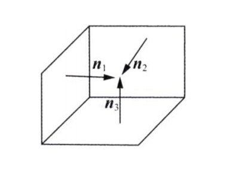
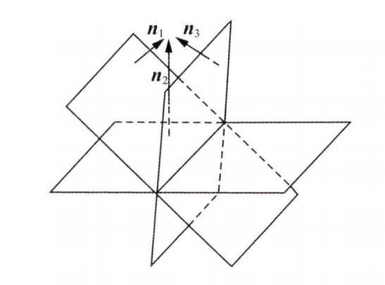
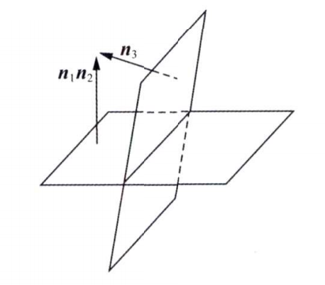
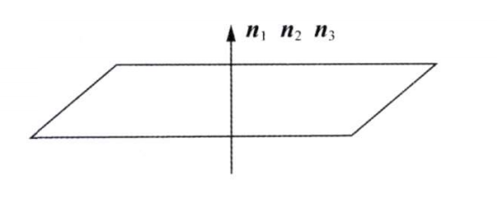
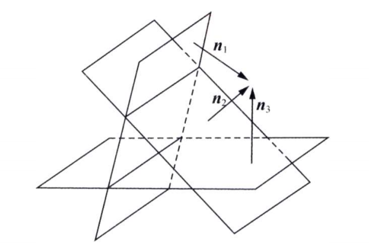
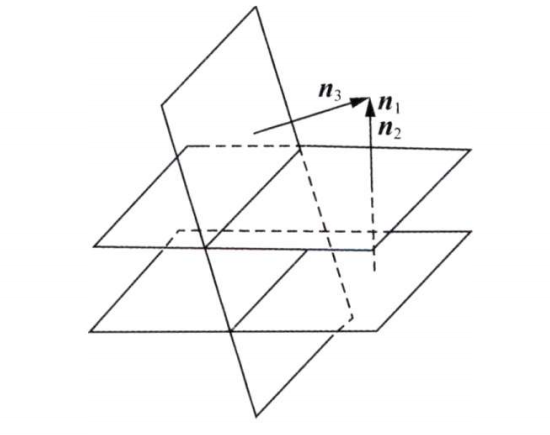
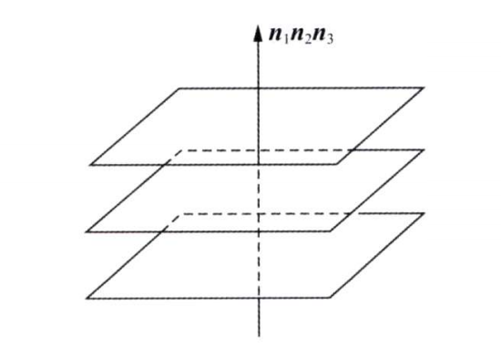
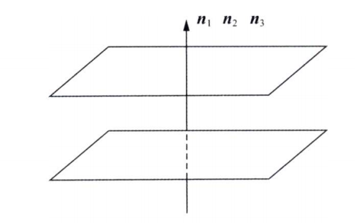

# 相似理论

### 关于矩阵对角化

+ 相似对角化与一般对角化不同，相似对角化的结果唯一，元素是特征值
+ 二次型即实对称阵可以用配方法也可以用正交变换法标准化(对角化)
  + 正交变换法即相似对角化（$Q^T = Q^{-1}$)，结果唯一，是特征值
  + 配方法即普通坐标变换法，结果不唯一，**且不是相似对角化**
+ 实对称矩阵既可以用可逆矩阵也可以用正交矩阵相似对角化，两种方法的结果一样（特征值）
+ 实对称矩阵可以对角化变为**任意正负惯性指数相同的对角阵**
  + 即**合同的矩阵不唯一**
  + 对角阵只需做伸缩变换，即可任意变换元素值
+ 配方法标准化其实就是求合同矩阵，而合同矩阵不唯一，因此标准化后的系数可以是任意值
  + 但正负惯性指数不会变
+ 不管怎么对角化，**规范型都是一样的**
  + 同一个二次型，正负惯性指数唯一

### Ax（列向量左乘矩阵）

+ 列向量左乘矩阵仍是列向量

##### $(Ax)^T(Ax)——平方和(一定非负)$

+ 记$(Ax)^T(Ax)=b_1^2+b_2^2 + ... + b_m^2 \ge 0$
+ $(Ax)^T(Ax)=0: $
  + $\forall b_i=0$
  + $Ax=0$
+ $(Ax)^T(Ax) > 0:$
  + $\exists b_i \ne 0$
  + $Ax\ne 0$

##### 可以证明$Ax=0和A^TAx=0$同解

### 矩阵等价、相似与合同对比

##### 1. 等价

+ A与B等价：A经初等变换得到B
+ PAQ = B（P、Q可逆）
+ P和Q没有任何关系
+ **充要条件**：r(A) = r(B)
+ A和B同型

##### 2. 相似

+ A与B相似：$\exists 可逆P，P^{-1}AP = B$

+ 判断相似

  1. 实对称$A\sim B \Lrarr \lambda_A = \lambda_B$

  2. 普通矩阵：相似对角化后的对角阵相同，则相似

     $A\sim \bigwedge, B\sim \bigwedge\Rarr A\sim B$

+ 判断不相似

  1. $|A| \ne |B|$
  2. $r(A) \ne r(B)$
  3. $\lambda_A \ne \lambda_B$
  4. $\sum a_{ii} \ne \sum b_{ii}$
  5. **一个能相似对角化，另一个不能**

##### 3. 合同(仅研究实对称即二次型)

> 为什么合同只研究对称矩阵？
>
> 因为对称矩阵的合同矩阵一定也是对称矩阵，考研不研究非对称矩阵的合同。

+ A与B合同：$\exists 可逆C, 使C^TAC = B$
+ 惯性定理：二次型经坐标变换正负惯性指数不变
+ **只要正负惯性指数相同，两矩阵必合同**

##### 4. 特征值相同但不相似的例子

+ 思路：**特征值没有重根，一定能相似对角化。**
  只要举出特征值重根但不能对角化的例子

+ $A=\begin{bmatrix}1 & 0 \\0 & 1\end{bmatrix}和B=\begin{bmatrix}1 & 1 \\0 & 1\end{bmatrix}$

  由于$r(E-B)=1$，于是B只有一个无关特征向量，因此不能对角化

+ $\begin{bmatrix}0 & 0 \\0 & 0\end{bmatrix}和\begin{bmatrix}0 & 1 \\0 & 0\end{bmatrix}$

##### 5. 实对称矩阵相似一定合同，合同不一定相似

+ $A\sim B \Lrarr \lambda_A = \lambda _B \Rarr 标准型相同\Lrarr 正负惯性指数相同\Rarr AB合同$
+ 合同只能说明正负惯性指数相同，**不能保证特征值相同**

##### 6. 两矩阵都不能相似对角化，它们俩也能相似

例：$A=\begin{bmatrix}1 &  & \\ & 0 & 1 \\ & & 0 \end{bmatrix}, B=\begin{bmatrix}1 &  & \\ & 0 & 2 \\ & & 0 \end{bmatrix}$

+ A、B都不能相似对角化（二重根0对应特征向量只有一个）
+ 根据定义$P^{-1}AP=B\Rarr AP=PB$
+ 可以想到$P=\begin{bmatrix}1 &  & \\ & 1 &  \\ & & 2 \end{bmatrix}$(第三行/列乘2)
+ 则$AP=\begin{bmatrix}1 &  & \\ & 0 & 2 \\ & & 0 \end{bmatrix}=PB$

### 求特征值

##### 由矩阵方程求特征值

+ 由矩阵方程只能得到特征值的**取值范围**
+ 例：$A^2=E\Rarr\lambda^2=1,\lambda=\pm1,即\lambda只可能取1和-1两种取值,$
  $但\lambda可能全为1,可能全为-1,即不能说1和-1必是A的特征值$

# 矩阵、向量和方程组理论

### 行列式公式

##### 1.$|A+\alpha\beta|=|A|(1+\beta A^{-1}\alpha)$

##### 2. $|\lambda E+\alpha\beta|=\lambda^n(1+\beta\lambda^{-1}\alpha)$

### 矩阵有关结论

##### 1. 互逆矩阵之和可能为0

+ $A=\begin{bmatrix}0 & -1 \\1 & 0\end{bmatrix}, B=\begin{bmatrix}0 & 1 \\-1 & 0\end{bmatrix}$
+ $AB=E, 但A+B=0$

##### 2. 矩阵秩的公式

+ $r(A+B)\le r(A)+r(B)$
+ $AB=0\Rarr r(A)+r(B)\le 内标$
+ $r(A)+r(B)\le n-r(AB)$
+ $A^2=A\Rarr r(A)+r(E-A)=n$
  $n= r(E)=r(A+E-A)\le r(A)+r(E-A)\le n$
+ $A^2=E\Rarr r(A+E)+r(A-E)=n$
  证明与上一个同理

### 抽象矩阵/行列式变形

##### $|A+B|$

+ $|A+B| = |EA+BE| = |BB^{-1}A + BA^{-1}A| = |B(B^{-1}+A^{-1})A|$
+ 线代辅导讲义例1.11

##### $|E+A^T|=|E+A|$

+ $|E+A^T|= |E^T+A^T|=|(E+A)^T|=|E+A|$
+ 880行列式基础，填空题7

##### $A=E+\alpha\beta^T$

+ $A^2=(E+\alpha\beta^T)(E+\alpha\beta^T)=E+\alpha\beta^T+\alpha\beta^T+\alpha\beta^T\alpha\beta^T$

+ 记$\beta^T\alpha = k$,则

  $A^2=E+(k+2)\alpha\beta^T=(k+2)A-(k+1)E$

+ **从而$A^{-1}=-\frac{1}{k+1}(A-(k+2)E)$**

##### $A^{-1}+B^{-1}$

+ $A^{-1}+B^{-1}=B^{-1}BA^{-1}+B^{-1}AA^{-1}=B^{-1}(B+A)A^{-1}$
+ $A^{-1}+B^{-1}=A^{-1}BB^{-1}+A^{-1}AB^{-1}=A^{-1}(B+A)B^{-1}$
+ **即$A^{-1}(A+B)B^{-1}=B^{-1}(A+B)A^{-1}$**

### 反对称矩阵

> 定义：$A^T = -A$

##### 性质

+ 主对角线一定是0（$a_{ii}=0$）

+ 对称位置相差负号（$a_{ij} = -a{ji}$）

+ $\begin{bmatrix}0& -1 & 5\\1 & 0 & -2 \\ -5& 2 & 0\end{bmatrix}$

+ $|A| = |A^T| = |-A| = (-1)^n|A|$

  易知**奇数阶的反对称阵行列式为0**

### 向量组等价

##### 概念

+ 两向量组可以互相表示

##### 充要条件

1. $\Lrarr r(\alpha_1, \alpha_2, ..., \alpha_s)=r(\beta_1, \beta_2, ... \beta_t),且可以单方向表示$
2. **==三秩相同==**：$\Lrarr r(\alpha_1, \alpha_2, ..., \alpha_s)=r(\beta_1, \beta_2, ... \beta_t)=r(\alpha_1, \alpha_2, ..., \alpha_s,\beta_1, \beta_2, ... \beta_t)$

### 方程组结论

##### 方程组同解

1. $Ax=0与A^TAx=0同解$
2. $A^Tx=0与AA^Tx=0同解$

##### A经初等列变换化为B

+ 等价于$AX=B$有解
+ 也等价于$r(A)=r(B)$（初等变换不变秩）

 

# 线性代数的本质

### 矩阵

### 线性方程组几何意义$Ax=b$

+ $A_{3\cross3}的行向量为三个平面的法向量$
+ 解$x=(x_0, y_0,z_0)为坐标$

#### 有解（即三平面交于一点或一条直线）

##### 1. 三平面交于一点：$r(A)=r(\overline{A})=3$

+ 即法向量线性无关
+ 方程组唯一解（解为一个点）

 

##### 2. 三平面交于一条线：$r(A)=r(\overline{A})=2$

+ 法向量共面，但不共线
+ 方程组无穷解（解集为一条直线）

 

##### 3. 三平面交于一条线，但两平面重合：$r(A)=r(\overline{A})=2$

+ 法向量共面，其中两个法向量共线

 

##### 4. 三平面重合：$r(A)=r(\overline{A})=1$

+ 三个法向量成比例（共线）
+ 解集为平面

 

#### 无解

##### 1. 三平面两两相交（交于三条平行直线）：$r(A)=2,r(\overline{A})=3$

+ 法向量共面，且任意两向量不共线
+ **A任意两个行向量线性无关**
+ **不可能出现三条直线不平行即三条交线交于两个点的情况**
  **（一个平面与一条直线只可能有一个交点，而三条交线任意两条都共面，因此交点必然只有一个）**

 

##### 2. 两平面平行，第三张平面与之相交（交于两条平行直线）：$r(A)=2,r(\overline{A})=3$

+ 法向量共面，其中两个法向量共线

 

##### 3. 三平面平行：$r(A)=1,r(\overline{A})=2$

+ 三个法向量成比例（共线）

 

##### 4. 两平面重合，第三张与之平行：$r(A)=1,r(\overline{A})=2$

+ 三个法向量成比例（共线）

 

### 向量空间

