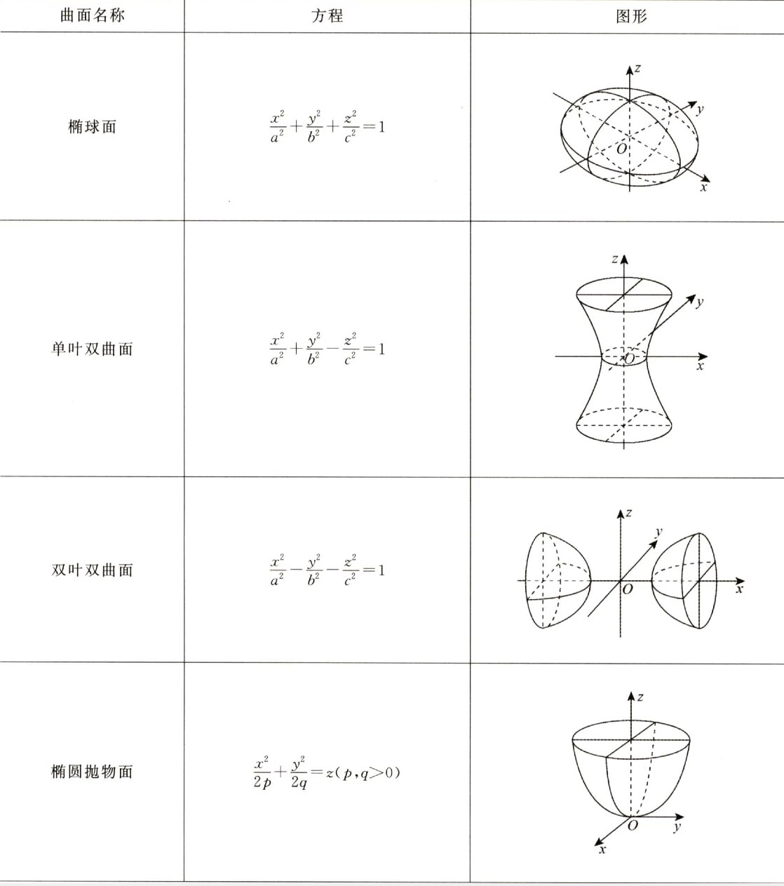
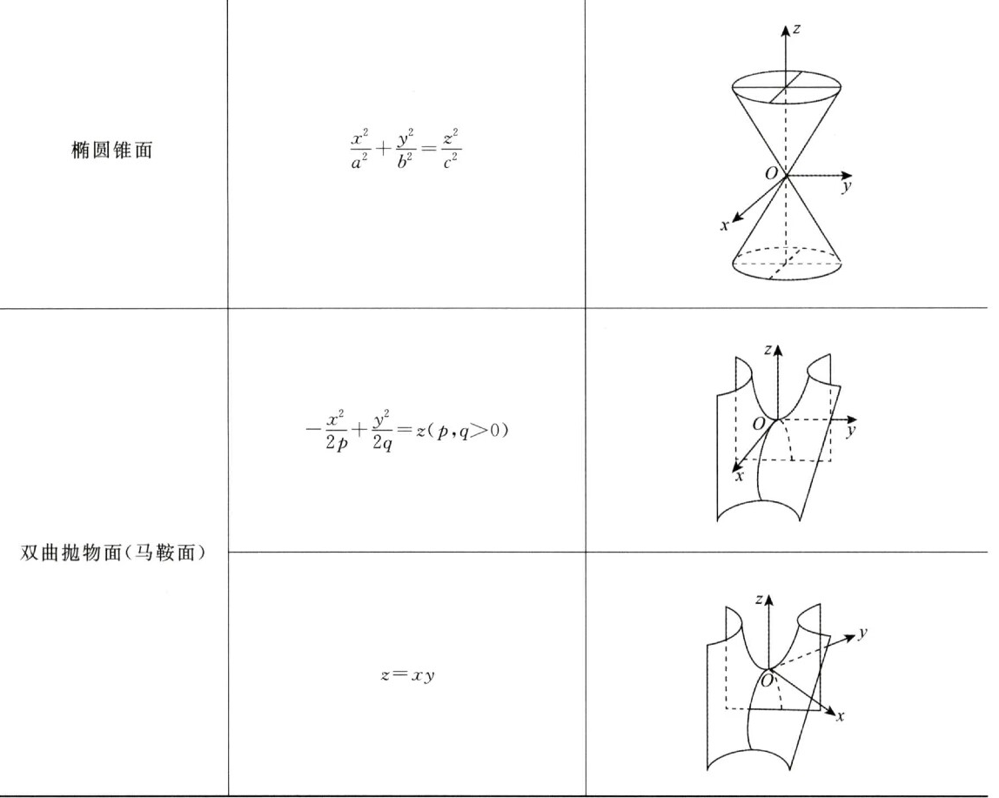

# 相似理论

### 关于矩阵对角化

+ 相似对角化与一般对角化不同，相似对角化的结果唯一，元素是特征值
+ 二次型即实对称阵可以用配方法也可以用正交变换法标准化(对角化)
  + 正交变换法即相似对角化（$Q^T = Q^{-1}$)，结果唯一，是特征值
  + 配方法即普通坐标变换法，结果不唯一，**且不是相似对角化**
+ 实对称矩阵既可以用可逆矩阵也可以用正交矩阵相似对角化，两种方法的结果一样（特征值）
+ 实对称矩阵可以对角化变为**任意正负惯性指数相同的对角阵**
  + 即**合同的矩阵不唯一**
  + 对角阵只需做伸缩变换，即可任意变换元素值
+ 配方法标准化其实就是求合同矩阵，而合同矩阵不唯一，因此标准化后的系数可以是任意值
  + 但正负惯性指数不会变
+ 不管怎么对角化，**规范型都是一样的**
  + 同一个二次型，正负惯性指数唯一

### 重要结论：Ax列向量左乘矩阵

> 列向量左乘矩阵仍是列向量

##### $(Ax)^T(Ax)——平方和(一定非负)$

+ 记$(Ax)^T(Ax)=b_1^2+b_2^2 + ... + b_m^2 \ge 0$
+ $(Ax)^T(Ax)=0: $
  + $\forall b_i=0$
  + $Ax=0$
+ $(Ax)^T(Ax) > 0:$
  + $\exists b_i \ne 0$
  + $Ax\ne 0$

##### 可以证明$Ax=0和A^TAx=0$同解

### 矩阵等价、相似与合同区别

##### 1. 等价

+ A与B等价：A经初等变换得到B
+ PAQ = B（P、Q可逆）
+ P和Q没有任何关系
+ **充要条件**：r(A) = r(B)
+ A和B同型

##### 2. 相似

+ A与B相似：$\exists 可逆P，P^{-1}AP = B$

+ 判断相似

  1. 实对称$A\sim B \Lrarr \lambda_A = \lambda_B$

  2. 普通矩阵：相似对角化后的对角阵相同，则相似

     $A\sim \bigwedge, B\sim \bigwedge\Rarr A\sim B$

+ 判断不相似（==由简到繁==）

  1. ==$\sum a_{ii} \ne \sum b_{ii}$——最简单==
  2. $r(A) \ne r(B)$
  3. $|A| \ne |B|$
  4. $\lambda_A \ne \lambda_B$
  5. **一个能相似对角化，另一个不能**

##### 3. 合同(仅研究实对称即二次型)

> 为什么合同只研究对称矩阵？
>
> 因为对称矩阵的合同矩阵一定也是对称矩阵，考研不研究非对称矩阵的合同。

+ A与B合同：$\exists 可逆C, 使C^TAC = B$
+ 惯性定理：二次型经坐标变换正负惯性指数不变
+ **只要正负惯性指数相同，两矩阵必合同**

##### 4. 特征值相同但不相似的例子

+ 思路：**特征值没有重根，一定能相似对角化。**
  只要举出特征值重根但不能对角化的例子

+ $A=\begin{bmatrix}1 & 0 \\0 & 1\end{bmatrix}和B=\begin{bmatrix}1 & 1 \\0 & 1\end{bmatrix}$

  由于$r(E-B)=1$，于是B只有一个无关特征向量，因此不能对角化

+ $\begin{bmatrix}0 & 0 \\0 & 0\end{bmatrix}和\begin{bmatrix}0 & 1 \\0 & 0\end{bmatrix}$

##### 5. 实对称矩阵相似一定合同，合同不一定相似

+ $A\sim B \Lrarr \lambda_A = \lambda _B \Rarr 标准型相同\Lrarr 正负惯性指数相同\Rarr AB合同$
+ 合同只能说明正负惯性指数相同，**不能保证特征值相同**

##### 6. 两矩阵都不能相似对角化，它们俩也能相似

例：$A=\begin{bmatrix}1 &  & \\ & 0 & 1 \\ & & 0 \end{bmatrix}, B=\begin{bmatrix}1 &  & \\ & 0 & 2 \\ & & 0 \end{bmatrix}$

+ A、B都不能相似对角化（二重根0对应特征向量只有一个）
+ 根据定义$P^{-1}AP=B\Rarr AP=PB$
+ 可以想到$P=\begin{bmatrix}1 &  & \\ & 1 &  \\ & & 2 \end{bmatrix}$(第三行/列乘2)
+ 则$AP=\begin{bmatrix}1 &  & \\ & 0 & 2 \\ & & 0 \end{bmatrix}=PB$

### 求特征值

##### 由矩阵方程求特征值

+ 由矩阵方程只能得到特征值的**取值范围**
+ 例：$A^2=E\Rarr\lambda^2=1,\lambda=\pm1,即\lambda只可能取1和-1两种取值,$
  $但\lambda可能全为1,可能全为-1,即不能说1和-1必是A的特征值$

# 矩阵、向量和方程组理论

### 矩阵有关结论

##### 1. 互逆矩阵之和可能为0

+ $A=\begin{bmatrix}0 & -1 \\1 & 0\end{bmatrix}, B=\begin{bmatrix}0 & 1 \\-1 & 0\end{bmatrix}$
+ $AB=E, 但A+B=0$

##### 2. 矩阵秩的公式

+ $r(A+B)\le r(A)+r(B)$
+ $AB=0\Rarr r(A)+r(B)\le 内标$
+ $r(A)+r(B)\le n-r(AB)$
+ $A^2=A\Rarr r(A)+r(E-A)=n$
  $n= r(E)=r(A+E-A)\le r(A)+r(E-A)\le n$
+ $A^2=E\Rarr r(A+E)+r(A-E)=n$
  证明与上一个同理

##### 3. 求逆的优化

> 已知A、B，求$AB^{-1}和BA^{-1}$

1. $\begin{pmatrix}A|B\end{pmatrix}初等行变换为\begin{pmatrix}E|AB^{-1}\end{pmatrix}$——行变换相当于左乘$A^{-1}$
2. $\begin{pmatrix}A\\B\end{pmatrix}初等列变换为\begin{pmatrix}E\\BA^{-1}\end{pmatrix}$——列变换相当于右乘$A^{-1}$

+ 用于求$A=P\bigwedge P^{-1}$

### 抽象矩阵/行列式变形

##### $|A+B|$

+ $|A+B| = |EA+BE| = |BB^{-1}A + BA^{-1}A| = |B(B^{-1}+A^{-1})A|$
+ 线代辅导讲义例1.11

##### $|E+A^T|=|E+A|$

+ $|E+A^T|= |E^T+A^T|=|(E+A)^T|=|E+A|$
+ 880行列式基础，填空题7

##### $A=E+\alpha\beta^T$

+ $A^2=(E+\alpha\beta^T)(E+\alpha\beta^T)=E+\alpha\beta^T+\alpha\beta^T+\alpha\beta^T\alpha\beta^T$

+ 记$\beta^T\alpha = k$,则

  $A^2=E+(k+2)\alpha\beta^T=(k+2)A-(k+1)E$

+ **从而$A^{-1}=-\frac{1}{k+1}(A-(k+2)E)$**

##### $A^{-1}+B^{-1}$

+ $A^{-1}+B^{-1}=B^{-1}BA^{-1}+B^{-1}AA^{-1}=B^{-1}(B+A)A^{-1}$
+ $A^{-1}+B^{-1}=A^{-1}BB^{-1}+A^{-1}AB^{-1}=A^{-1}(B+A)B^{-1}$
+ **即$A^{-1}(A+B)B^{-1}=B^{-1}(A+B)A^{-1}$**

### 反对称矩阵

> 定义：$A^T = -A$

##### 性质

+ 主对角线一定是0（$a_{ii}=0$）

+ 对称位置相差负号（$a_{ij} = -a{ji}$）

+ $\begin{bmatrix}0& -1 & 5\\1 & 0 & -2 \\ -5& 2 & 0\end{bmatrix}$

+ $|A| = |A^T| = |-A| = (-1)^n|A|$

  易知**奇数阶的反对称阵行列式为0**

### 向量组等价

##### 概念

+ 两向量组可以互相表示

##### 充要条件

1. $\Lrarr r(\alpha_1, \alpha_2, ..., \alpha_s)=r(\beta_1, \beta_2, ... \beta_t),且可以单方向表示$
2. **==三秩相等==**：$\Lrarr r(\alpha_1, \alpha_2, ..., \alpha_s)=r(\beta_1, \beta_2, ... \beta_t)=r(\alpha_1, \alpha_2, ..., \alpha_s,\beta_1, \beta_2, ... \beta_t)$

### 方程组结论

#### 同解方程组

1. $Ax=0与A^TAx=0同解$
2. $A^Tx=0与AA^Tx=0同解$

#### A经初等列变换化为B

+ 等价于$AX=B$有解
+ 也等价于$r(A)=r(B)$（初等变换不变秩）

#### 同解和公共解的区别

> 已知两方程组$(I)Ax=\beta_1和(II)Ax=\beta_2$

##### 1. $(I)和(II)的公共解$

+ 只要将两方程组联立，变成一个新的方程组
+ 新方程组的解就是公共解
+ ==联立后约束条件变多了==

##### 2. $(I)和(II)同解$

+ 要同解，==必须满足(I)和(II)以及联立后的系数矩阵三秩相等！！！==
+ 即==$r(A)=r(B)=r\begin{pmatrix}A\\B\end{pmatrix}$==
+ **理解：俩方程组同解，说明这两方程组是一样的，相当于一个方程组，联立之后当然还是同一个方程组**

#### $A的列向量是A^*x=0的解$

> 2011、2020

+ $Ax=0有非零解\Rarr r(A)<n\Rarr |A|=0\Rarr AA^*=A^*A=|A|E=0$
+ 看到$AB=0，想到\begin{cases} r(A)+r(B)\le n\\B的列向量全是Ax=0的解 \end{cases}$
+ 因此由$A^*A=0\Rarr A的列向量是A^*x=0的解$

# 线性代数的本质

### 线性方程组几何意义$Ax=b$

+ $A_{3\cross3}的行向量为三个平面的法向量$
+ 解$x=(x_0, y_0,z_0)为坐标$

#### 有解（即三平面交于一点或一条直线）

##### 1. 三平面交于一点：$r(A)=r(\overline{A})=3$

+ 即法向量线性无关
+ 方程组唯一解（解为一个点）

 

##### 2. 三平面交于一条线：$r(A)=r(\overline{A})=2$

+ 法向量共面，但不共线
+ 方程组无穷解（解集为一条直线）

 

##### 3. 三平面交于一条线，但两平面重合：$r(A)=r(\overline{A})=2$

+ 法向量共面，其中两个法向量共线

 

##### 4. 三平面重合：$r(A)=r(\overline{A})=1$

+ 三个法向量成比例（共线）
+ 解集为平面

 

#### 无解

##### 1. 三平面两两相交（交于三条平行直线）：$r(A)=2,r(\overline{A})=3$

+ 法向量共面，且任意两向量不共线
+ **A任意两个行向量线性无关**
+ **不可能出现三条直线不平行即三条交线交于两个点的情况**
  **（一个平面与一条直线只可能有一个交点，而三条交线任意两条都共面，因此交点必然只有一个）**

 

##### 2. 两平面平行，第三张平面与之相交（交于两条平行直线）：$r(A)=2,r(\overline{A})=3$

+ 法向量共面，其中两个法向量共线

 

##### 3. 三平面平行：$r(A)=1,r(\overline{A})=2$

+ 三个法向量成比例（共线）

 

##### 4. 两平面重合，第三张与之平行：$r(A)=1,r(\overline{A})=2$

+ 三个法向量成比例（共线）

 

### 向量空间

#### 各种概念

1. 基：即基础解系，基础解系**个数**=向量空间**维数**
2. 规范正交基：即坐标轴方向的单位向量
3. 在基下的坐标：即线性表示中基的系数
4. 过渡矩阵：$(\alpha_1,\alpha_2,...,\alpha_n)C=(\beta_1,\beta_2,...,\beta_n)，称C为由基\alpha到基\beta的过渡矩阵$（==右乘过渡==）

#### 性质

1. 过渡矩阵可逆
2. ==过渡矩阵与坐标变换方向是反的！==
   $若(\beta_1,\beta_2,...,\beta_n)=(\alpha_1,\alpha_2,...,\alpha_n)C，则y=C^{-1}x,其中x,y是同一个向量分别在(\alpha_1,\alpha_2,...,\alpha_n)和(\beta_1,\beta_2,...,\beta_n)下的坐标$
3. 两规范正交基间的过渡矩阵为正交矩阵

### 标准型与空间曲面

#### 对应表格

| $\lambda_1,\lambda_2,\lambda_3$的符号 | $f(x_1,x_2,x_3)=1$ |
| ------------------------------------- | ------------------ |
| 3正                                   | 椭球面             |
| 2正1负                                | 单叶双曲面         |
| 1正2负                                | 双页双曲面         |
| 2正1零                                | 椭圆柱面           |
| 1正1负1零                             | 双曲柱面           |

#### 曲面图像

# 线代做题大招

### 重要结论

##### 1. $r(A)=1$

> 姜150例2

+ $r(A)=1\Lrarr A成比例(行列都成比例！！！)$——秩为1，即只有一个有效向量，==不管怎么组合都成比例==

+ $\Lrarr \lambda_1=tr(A), \lambda_2=...=\lambda_n=0$

+ $\Lrarr A^n=tr^{n-1}A$

+ $\Lrarr A的特征向量就是列向量$

  即$A\begin{pmatrix}a_{1i}\\a_{2i}\\a_{3i}\end{pmatrix}=tr(A)\begin{pmatrix}a_{1i}\\a_{2i}\\a_{3i}\end{pmatrix}$

+ $\Lrarr tr(A)\ne0\Rarr A必能相似对角化$
  若$tr(A)=0,则0为n重特征值,但n-r(A)=n-1\ne n,因此不能相似对角化$

+ $若A为实对称,则A=\lambda_1\gamma_1\gamma_1^T,其中\lambda_1=tr(A),\gamma_1为列向量\alpha_1的单位化$

##### 2. $AB=aA+bB$

> 姜150例4

1. $AB=BA$
2. $r(A)=r(B)$
3. $A与B的特征向量相同(特征值不同)$

##### 3. 行满秩与列满秩

> 行满秩：$A_{m\times n},r(A)=m(\le n)$

1. $BA=CA\Rarr B=C$（==右乘行满秩可以消去==）
   + $B和C都是对A做行变换,而对行满秩矩阵做行变换后相等,变换矩阵必相等$
2. $r(BA)=r(B)$（==右乘行满秩，秩不变==）
3. A行向量无关
4. $非齐次方程AX=b$==有解==（是不是唯一解取决于m是否等于n）
   + $r(A)=r(A|b)=m(?n)$

> 列满秩：$A_{m\times n},r(A)=n(\le m)$

1. $AB=AC\Rarr B=C$（==左乘列满秩可以消去==）
2. $r(AB)=r(B)$（==左乘列满秩，秩不变==）
3. A列向量无关
4. $齐次方程AX=0$==只有零解==
5. $ABX=0与BX=0同解$（可消去）

##### 4. $E+\beta\beta^T可逆$

> 其中$\beta为单位列向量,即\beta^T\beta=1$

法一：可逆定义

+ 记$B=\beta\beta^T,由r(B)=1,tr(B)=\beta^T\beta=1,得B^2=B$
+ 即$B^2+2B+E=3B+E=3(B+E)-2E$
  $\Rarr (B+E)^2-3(B+E)=-2E$
  $\Rarr(B+E)(B+E-3E)=-2E$
+ 因此$B+E可逆$

==法二：特征值==

+ $\lambda_B=1, 0, ..., 0\Rarr \lambda_{E+B}=2, 1, ..., 1\Rarr|E+B|=2\Lrarr E+B可逆$

##### 5. $r(A^n)=r(A^{n+1})=r(A^{n+2})=...$

> A是n阶矩阵

+ $A^nx=0与A^{n+1}x=0同解$
+ 姜150例26以及线代41
+ **应用：$A_{2\times2},则A^5=0\Lrarr A^2=0$**（==某次幂等于零，只要知道阶数就能反推==）

##### 6. $AB和BA特征值相同$

##### 7. 能正交对角化的==充要==条件：实对称

+ ==A的n个特征向量相互正交$\Lrarr$A实对称==

  

##### 8. $A^k=0\Rarr |A|=0$

+ 即可逆矩阵的幂不可能是0

##### 9. 相似表格

| $A$        | $\lambda$             | $\alpha$       |
| ---------- | --------------------- | -------------- |
| $A^k$      | $\lambda^k$           | $\alpha$       |
| $f(A)$     | $f(\lambda)$          | $\alpha$       |
| $A^{-1}$   | $\frac{1}{\lambda}$   | $\alpha$       |
| $A^*$      | $\frac{|A|}{\lambda}$ | $\alpha$       |
| $P^{-1}AP$ | $\lambda$             | $P^{-1}\alpha$ |
| $PAP^{-1}$ | $\lambda$             | $P\alpha$      |
| $A^T$      | $\lambda$             | none           |

##### 10. 判断相似

1. $A\sim B$，则：
   + $A^k\sim B^k$
   + $A^T\sim B^T$
   + $A^{-1}\sim B^{-1}$
   + $A^*\sim B^*$
   + $f(A)\sim f(B)$（==$f中可有A^k、A^{-1}、A^*、E,但绝不能有A^T!$==）
2. $A_1\sim B_1, A_2\sim B_2$，但
   + $A_1+A_2\sim B_1+B_2$——==不一定！==
   + $A_1A_2\sim B_1B_2$——==不一定！==

### 秒杀方法

#### 由二求一

> 已知$\alpha_1,\alpha_2$（无关）,求$\alpha_3$（与$\alpha_1、\alpha_2$均正交）
> 则$\alpha_3=\alpha_1\times\alpha_2=\begin{vmatrix}i& j & k\\ x_1& x_2 & x_3 \\ y_1& y_2 & y_3\end{vmatrix}$

1. 题型1：实对称矩阵不同特征向量正交

   + 已知两特征向量，求第三个特征向量

2. 题型2:齐次方程组$AX=0$的行向量与解向量正交

   + $r(A)=2\Rarr 基础解系为一个向量$

     已知A线性无关的两行,就能直接得到基础解系

   + 同理,$r(A)=1\Rarr基础解系为2个向量$
     已知两个解向量,就能直接得到A

#### 行列式公式

1. $|A+\alpha\beta|=|A|(1+\beta A^{-1}\alpha)$

2. $|\lambda E+\alpha\beta|=\lambda^n(1+\beta\lambda^{-1}\alpha)$

3. $|E-AB|=|E-BA|$

   + 只要是方阵，两行列式必相等（不需要同阶！！）

   + 严重超纲

4. 二阶差分方程（见刷题班数列极限）

#### 相似矩阵传递性

> $A\sim B,要求P,使得P^{-1}AP=B$

+ 不需要轮流求两组特征向量，将A和B化为对角阵
+ 直接解方程组！
  1. $设P=(\alpha_1, \alpha_2,\alpha_3)——可逆$
  2. $根据AP=PB,得到三组方程组,直接解得\alpha_1,\alpha_2,\alpha_3$
     + $A\alpha_1=...$
       $A\alpha_2=...$
       $A\alpha_3=...$

#### 实对称矩阵分解定理

> $Q^TAQ=\bigwedge,其中Q=(\gamma_1,\gamma_2,\gamma_3)为正交矩阵$

+ 由正交矩阵反求实对称矩阵A：
+ $A=\begin{pmatrix}\gamma_1,\gamma_2,\gamma_3\end{pmatrix}\begin{pmatrix}\lambda_1&&\\&\lambda_2&\\&&\lambda_3\end{pmatrix}\begin{pmatrix}\gamma_1^T\\\gamma_2^T\\\gamma_3^T\end{pmatrix}=\lambda_1\gamma_1\gamma_1^T+\lambda_2\gamma_2\gamma_2^T+\lambda_3\gamma_3\gamma_3^T$

#### 合同变换法

> 已知$A、B,求可逆C,使得C^TAC=B$

+ $\begin{pmatrix}A\\E\end{pmatrix}行列同时变换为\begin{pmatrix}C^TAC\\EC\end{pmatrix}=\begin{pmatrix}\bigwedge\\C\end{pmatrix}$==（下面的E只会同时做列变换，A做行变换不影响E）==
+ **行列同时变换举例：**
  1. **第一行加到第二行时，第一列也要加到第二列；**
  2. **第一行乘2，第一列也要乘2**

##### 若B不是$\bigwedge$，则需要将B也变换成$\bigwedge$（==规范型==）再将变换矩阵组合

+ $\begin{pmatrix}A\\E\end{pmatrix}\rarr\begin{pmatrix}\bigwedge\\C_1\end{pmatrix},\begin{pmatrix}B\\E\end{pmatrix}\rarr\begin{pmatrix}\bigwedge\\C_2\end{pmatrix}$——==**合同矩阵规范型一样**==
+ $C_1^TAC_1=\bigwedge=C_2^TBC_2\Rarr (C_1C_2^{-1})^TA(C_1C_2^{-1})=B$
+ $令C=C_1C_2^{-1},则C^TAC=B$

#### 经典实对称求逆

$A=\begin{pmatrix}2&1&1\\1&2&1\\1&1&2\ \end{pmatrix}=\begin{pmatrix}1&1&1\\1&1&1\\1&1&1\ \end{pmatrix}+E=B+E$

$\Rarr B=A-E,B^2=3B=3(A-E)=(A-E)^2$

==$\Rarr A(A-5E)=-4E\Rarr A^{-1}=-\frac{1}{4}(B-5E)$==
