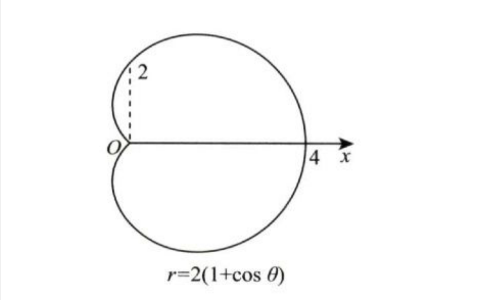
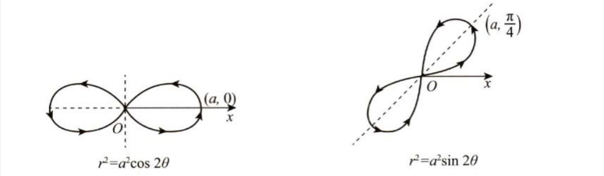

数学重要公式与结论

****

## 公式

#### 高等数学

##### 1.点火公式

$ \int _{0}^{\frac{\pi}{2}} \sin^n xdx = \int_0^\frac{\pi}{2} \cos^nx dx= 
\begin{cases} 
\frac{n-1}{n} · \frac{n-3}{n-2} · \dots · \frac{1}{2} · \frac{\pi}{2} ,\quad n为正偶数\\
\frac{n-1}{n} · \frac{n-3}{n-2} · \dots · \frac{2}{3} ,\quad n为大于1的奇数
\end{cases} $

特别地，

$ \int^{2\pi}_0\sin^nxdx = \int^{2\pi}_0\cos^nxdx = \begin{cases} 0, \quad n为奇数 \\2\int^{\pi}_0\sin^nxdx = 4\int^{\frac{\pi}{2}}_0\sin^nxdx \end{cases} $

##### 2.翻转公式
（1）$\int_a^bf(x)=\int_a^bf(a+b-x)dx$

（2）$\int_0^\pi xf(sinx)dx=\frac{\pi}{2}\int_0^\pi f(sinx)$

##### 3.$\Gamma$函数

$\Gamma(n) = \int^{+\infty}_0x^ne^{-x}dx = n!$

$\int^{+\infty}_0x^ne^{-ax}dx = \frac{n!}{a^{n+1}}$

##### 4.万能代换

$令\tan\frac{x}{2} = t \\ 则\sin{x} = \frac{2t}{1+t^2}, cos{x} = \frac{1-t^2}{1+t^2}, \int{R(\sin{x}, \cos{x})dx = \int{R(\frac{2t}{1+t^2}, \frac{1-t^2}{1+t^2})\frac{2}{1+t^2}}dt}$

##### 5. 等价无穷小

$1-\cos^\alpha x\sim \frac{\alpha}{2}x^2$

$\ln(x+\sqrt{1+x^2})\sim x$

$\tan x-\sin x\sim \frac{1}{2}x^3$

##### 6.积分表

$ \int {\tan{x}} = -\ln{|\cos{x}|}+C $

$\int\cot{x}dx = \ln|\sin{x}| + C$

$\int\sec{x}dx = \ln{|\sec{x} + \tan{x}|} + C$

$\int\csc{x}dx = \ln{|\csc{x}-cot{x}|} + C$ 

$\int\frac{1}{a^2+x^2}dx = \frac{1}{a}\arctan\frac{x}{a} + C$

$\int\frac{1}{a^2-x^2}dx = \frac{1}{2a}\ln{|\frac{a+x}{a-x}|} + C$

$\int\frac{1}{x^2-a^2}dx = \frac{1}{2a}\ln{|\frac{x-a}{x+a}|} + C$

$\int\frac{1}{\sqrt{a^2-x^2}}dx = \arcsin{\frac{x}{a}} + C$

$\int\frac{1}{\sqrt{x^2\pm a^2}}dx = \ln{|x + \sqrt{x^2\pm a^2}|} + C$
$$

$$
$\int \sqrt{x^2+a^2} dx = \frac{x}{2}\sqrt{x^2+a^2} + \frac{a^2}{2}\ln(x+\sqrt{x^2+a^2}) + C$

$\int\sqrt{x^2-a^2}dx = \frac{x}{2}\sqrt{x^2-a^2} - \frac{a^2}{2}\ln{(x+\sqrt{x^2-a^2})} + C$

$\int\sqrt{a^2-x^2}dx = \frac{x}{2}\sqrt{a^2-x^2} + \frac{a^2}{2}\arcsin{\frac{x}{a}} + C$ 

$\int\frac{1}{1+e^{ax}}dx = x - \frac{1}{a}\ln{(1+e^{ax})} + C$

$ \frac{1}{\sin{x}\cos{x}} dx= d\ln{\tan{x}} $

==$\frac{x}{\sqrt{1+x^2}}dx = d\sqrt{1+x^2}$==(**分部极其重要**)

$\int\frac{1}{\sqrt[n]{(ax+b)^{n-1}(cx+d)^{n+1}}}dx=\frac{n}{ad-bc}\sqrt[n]{\frac{ax+b}{cx+d}}+C$

$\frac{1}{\sqrt{x-x^2}}dx=2d\arcsin \sqrt x=d\arcsin (2x-1)=2d\arctan \sqrt{\frac{x}{1-x}}$

$\int\frac{dx}{a^2sin^2x+b^2cos^2x}=\frac{1}{ab}\arctan\frac{a\tan x}{b}+C$

$\int xe^{-x}dx=-e^{-x}(x+1)+C$

##### 7. 泰勒公式

$e^x = 1 + x + \frac{x^2}{2!} + ... + \frac{x^n}{n!} + o(x^n)$

$\sin{x} = x - \frac{x^3}{3!} + ... + (-1)^n\frac{x^{2n-1}}{(2n-1)!} + o(x^{2n-1})$

$\cos{x} = 1 - \frac{x^2}{2!} + ... + (-1)^n\frac{x^{2n}}{(2n)!} + o(x^{2n})$

$\ln{(1+x)}  = x - \frac{x^2}{2} + ... + (-1)^{n-1}\frac{x^n}{n} + o(n)$

$(1+x)^\alpha = 1 + \alpha x + \frac{\alpha(\alpha-1)}{2!} + ... + \frac{\alpha(\alpha-1)...(\alpha-n+1)}{n!}x^n + o(x^n)$

$\tan{x} = x + \frac{1}{3}x^3 + o(x^3)$

$\arcsin{x} = x + \frac{1}{6}x^3 + o(x^3)$

$\arctan{x} = x - \frac{1}{3}x^3 + o(x^3)$

##### 8. 泰勒级数

$\frac{1}{1-x} = \sum^\infty_{n=0}x^n = 1 + x + x^2 + ... + x^n + ...,\quad -1<x<1$

$\frac{1}{1+x} = \sum^\infty_{n=0}(-1)^nx^n = 1-x + x^2 -... + (-1)^nx^n + ..., \quad -1<x<1$

$e^x = \sum^\infty_{n=0}\frac{x^n}{n!} = 1 + x + \frac{x^2}{2!} + ... + \frac{x^n}{n!} + ..., \quad -\infty < x < +\infty$

$\sin{x} = \sum^\infty_{n=0} \frac{(-1)^nx^{2n+1}}{(2n+1)!}= x - \frac{x^3}{3!} + ... + \frac{(-1)^nx^{2n+1}}{(2n+1)!} + ..., \quad -\infty < x < +\infty$

$\cos{x} = \sum^\infty_{n=0}\frac{(-1)^nx^{2n}}{(2n)!} = 1 - \frac{x^2}{2!} + ... + \frac{(-1)^nx^{2n}}{(2n)!} + ..., \quad -\infty < x < +\infty$

$\ln{(1+x)} = \sum^\infty_{n=1} \frac{(-1)^{n-1}x^n}{n} = x - \frac{x^2}{2} + ... + \frac{(-1)^{n-1}x^n}{n} + ..., \quad-1 < x \le1$

$(1+x)^\alpha = \sum^\infty_{n=0}\frac{\alpha(\alpha-1)...(\alpha-n+1)x^n}{n!} = 1 + \alpha{x} + \frac{\alpha(\alpha-1)}{2!}x^2 + ... + \frac{\alpha(\alpha-1)...(\alpha-n+1)}{n!}x^n + ..., \quad -1<x<1,区间端点展开式是否成立由\alpha的值确定$

##### 9.$\Beta$函数

$\Beta(p,q)=\int_0^1x^{p-1}(1-x)^{q-1}dx$

1. $\Beta(p,q)=\Beta(q,p)$（函数值与变量顺序无关）

2. $Beta(p,q)=\frac{q-1}{p+q-1}\Beta(p,q-1)$

   $=\frac{p-1}{q+p-1}\Beta(p-1,q)$

   $=\frac{(p-1)(q-1)}{(p+q-1)(p+q-2)}\Beta(p-1,q-1)$

#### 初等数学

##### 1. 和差化积

> sin=帅，cos=哥

+ $\sin\alpha+\sin\beta=2\sin\frac{\alpha+\beta}{2}\cos\frac{\alpha-\beta}{2}$（帅+帅=帅哥）
+ $\sin\alpha-\sin\beta=2\cos\frac{\alpha+\beta}{2}\sin\frac{\alpha-\beta}{2}$（帅-帅-哥帅）
+ $\cos\alpha+\cos\beta=2\cos\frac{\alpha+\beta}{2}\cos\frac{\alpha-\beta}{2}$（哥+哥=哥哥）
+ $\cos\alpha-\cos\beta=-2\sin\frac{\alpha+\beta}{2}\sin\frac{\alpha-\beta}{2}$

##### 2. 积化和差

+ $\sin\alpha\cos\beta=\frac{1}{2}[\sin(\alpha+\beta)+\sin(\alpha-\beta)]$（帅哥=（帅+帅）/ 2）
+ $\cos\alpha\cos\beta=\frac{1}{2}[\cos(\alpha+\beta)+\cos(\alpha-\beta)]$（哥哥=（哥+哥）/2）
+ $\sin\alpha\sin\beta=\frac{1}{2}[\cos(\alpha-\beta)-\cos(\alpha+\beta)]$

##### 3. 三角恒等式

$\arctan{x} + \arctan{\frac{1}{x}} = \frac{\pi}{2}$

$\arcsin{x} + arccos{x} = \frac{\pi}{2}$

##### 4. 倍角公式

##### 5. 半角公式

##### 6. 和差公式

##### 7. 万能公式

****

## 结论

#### 秒杀公式

##### 1. 变限积分无穷小比阶

$x\rarr 0时，f(x)为m阶无穷小，g(x)为n阶无穷小，则\int^{g(x)}_0f(x)dx为(m+1)n阶无穷小。$

##### 2. 几个重要极限

1. $\lim_{x\rarr0}\frac{e-(1+x)^{\frac{1}{x}}}{x}=\frac{e}{2}$

   $\lim_{x\rarr\infty}x[e-(1+\frac{1}{x})^x]=\frac{e}{2}$

2. $\lim_{x\rarr\infty}(\frac{ax+b}{ax+c})^{hx+k}=e^\frac{(b-c)h}{a}$

3. $\lim_{x\rarr0}(\frac{a^x+b^x+c^x}{3})^{\frac{1}{x}}=\sqrt[3]{abc}$

##### 3. $f(x)=\begin{cases}x^\alpha \sin\frac{1}{x^\beta} ,\quad x\ne0 \\0,\quad x=0\\\end{cases}$

1. $\alpha>0:f(x)连续$
2. $\alpha>1:f^{'}(0)存在(f^{'}(x)连续)$
3. $\alpha>\beta+1:f^{'}(x)连续$
4. $\alpha>\beta+2：f^{''}(0)存在(f^{''}(x)连续)$

##### 4. 六个定积分

$(1)\int_0^a\sqrt{a^2-x^2}dx=\frac{\pi}{4}a^2(四分之一圆面积)$

$(2)\int_0^ax\sqrt{a^2-x^2}dx=\frac{1}{3}a^3(奇次幂没有\pi)$

$(3)\int_0^ax^2\sqrt{a^2-x^2}dx=\frac{\pi}{16}a^4$

$(4)\int_0^a\frac{1}{\sqrt{a^2-x^2}}dx=\frac{\pi}{2}$

$(5)\int_0^a\frac{x}{\sqrt{a^2-x^2}}dx=a(奇次幂没有\pi)$

$(6)\int_0^a\frac{x^2}{\sqrt{a^2-x^2}}dx=\frac{\pi}{4}a^2(同1)$

##### 5. 心形线面积

1. 表达式：$r=a(1\pm\cos\theta)$
2. 面积$S=\frac{3}{2}\pi a^2$

##### 6. 双纽线面积

1. 表达式：$r^2=2a^2\cos2\theta$
   				$(x^2+y^2)^2=2a^2(x^2-y^2)$
2. 面积$S=2a^2$

