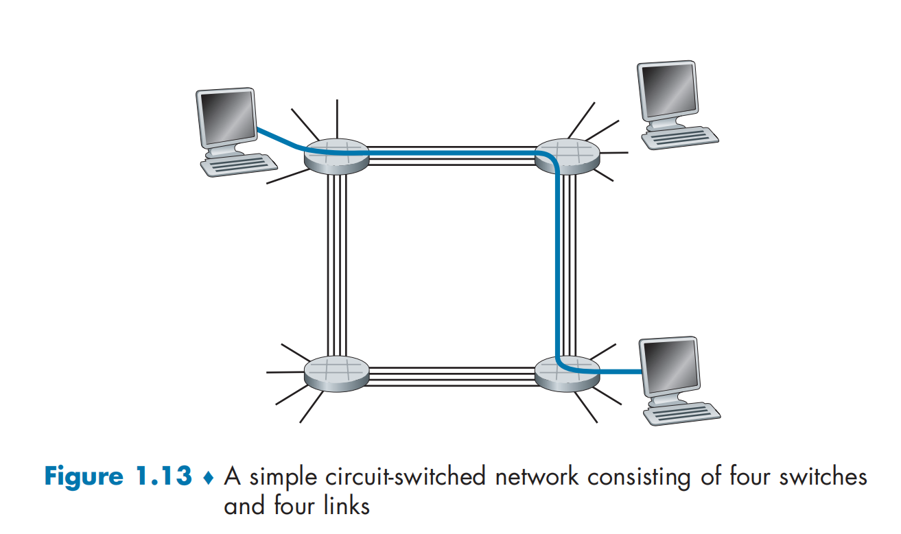
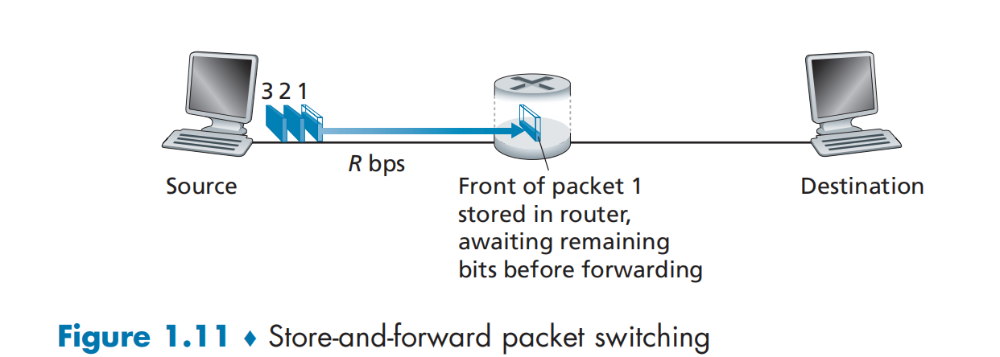
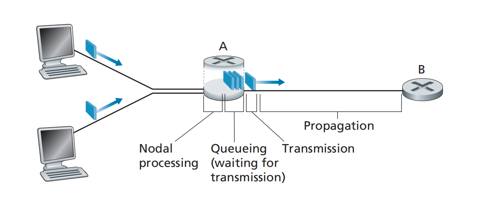
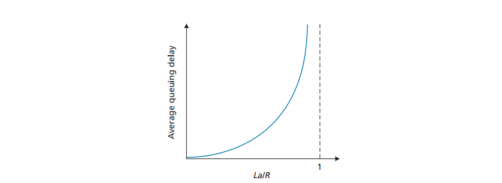
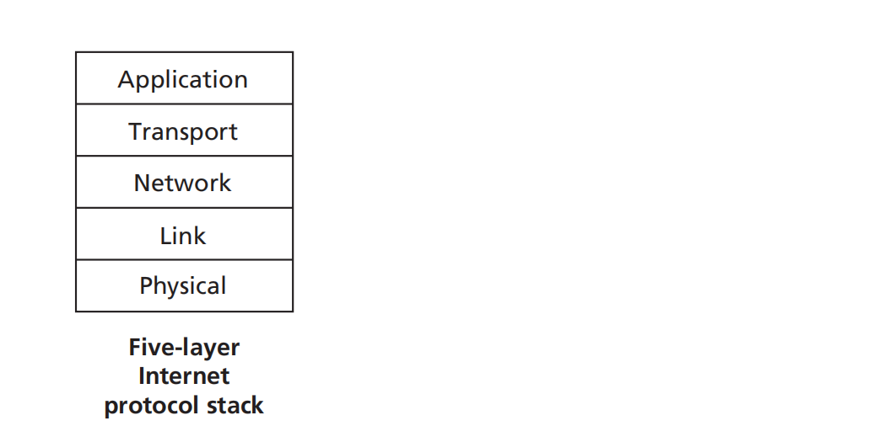
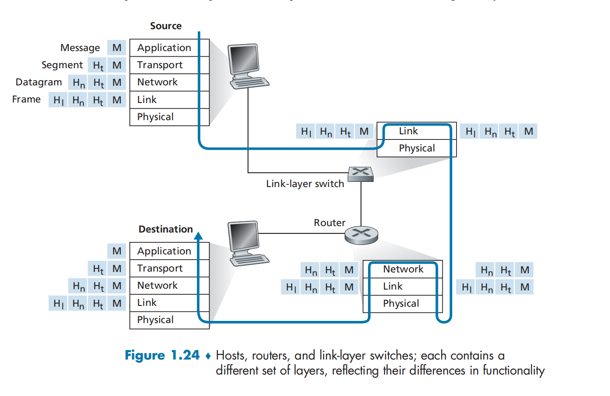

《Computer Networking A Top-Down Approach》配合中科大郑烇老师视频

****

## Chapter I Computer Networks and the Internet

### 1.1 What is the Internet?

#### 描述（从构成的角度）

##### 网络：结点和边

一般地，方形代表主机结点，即数据传送的源头。圆形代表路由器交换机。

> End Systems are connected together by a network of **communication links** and **packet switches**.

##### 链路：将结点连在一起的边

> The sequence of communication links and packet switches traversed by a packet from the sending end system
>
> to the receiving end system is known as a **route** or **path** through the network

#### what is a protocol？

##### 协议：对等层的实体在通信过程中应该遵守的规则集合

> A protocol defines the **format** and the **order** of messages exchanged between two or more communicating entities,
>
> as well as the **actions** taken on the transmission and/or receipt of a message or other event.

##### 协议规范了：

+ 语法
+ 语义
+ 格式
+ 时序
+ 动作

#### 从服务角度看Intenet

##### 是使用通信设施进行通信的分布式应用

+ Web、VoIP、email、游戏、电子商务、社交网络...

##### 为分布式应用提供服务的基础设施

通信基础设施为apps提供API

+ 将发送和接收数据的apps与互联网连接起来
+ 为apps应用提供服务选择，类似于邮政服务

#### 网络结构

##### 网络边缘：

+ 主机
+ 应用程序（客户端和服务器）

##### 网络核心：

+ 互联着的路由器
+ 网络的网络

##### 接入网、物理媒介：

+ 有线或无线通信链路

### 1.2 The Network Edge

#### 两种模式

##### End System:

> End Systems are also referred to as hosts.
>
> Hosts are sometimes further divided into two categories: **clients and servers**.

+ 运行应用程序
+ 如Web、email
+ 在网络“边缘”

##### C/S模式（客户端/服务器）

+ 客户端向服务器请求、接收服务
+ 如Web浏览器/服务器；email客户端/服务器

##### P2P模式（对等模式）

+ 很少（甚至没有）专门的服务器
+ 如Gnutella、KaZaA、Emule

#### 协议

##### TCP-Transmission Control Protocol（传输控制协议）

+ Internet上**面向连接**的服务

**TCP提供的服务**

+ **可靠地**、按顺序地传送数据

  确认和重传

+ 流量控制：避免发送速度太快，接收方来不及处理

+ 拥塞控制：当网络拥塞时，发送方降低发送速率

##### UDP-User Datagram Protocol（用户数据报协议）

+ **无连接**
+ 不可靠数据传输
+ 无流量控制
+ 无拥塞控制

##### 使用TCP的应用：

+ HTTP（Web）
+ FTP(文件传送)
+ SMTP（email）

##### 使用UDP的应用：

+ 流媒体
+ 远程会议
+ DNS
+ Internet电话

### 1.3 The Network Core

**网络核心：路由器的网状网络**

**基本问题：数据怎样通过网络进行传输？**

#### Circuit Switching（线路交换）

> Before the sender can send the information, the network must establish a connection between the sender and ther receiver.
> This connection is called a **circuit**.

+ 为每个呼叫预留一条专有电路，如**电话网**
+ **独享资源**:每个呼叫一旦建立起来就能够保证性能
+ 如果呼叫没有数据发送，被分配的资源就会被浪费
+ 通常被传统电话网采用

 

> Each of these links has four circuits, so that each link can support four simultaneous connections.
>
> In order for Host A to communicate with Host B, the network must **first reserve one citcuit on each of two links.**

+ 需要为呼叫预留端-端资源

##### 网络资源（如带宽）分片

+ 频分（Frequency-division multiplexing)FDM
+ 时分（Time-division multiplexing）TDM
+ 波分（Wave-division multiplexing）WDM

##### 线路交换不适合计算机时间的通信

+ 建立连接时间长
+ 计算机之间的通信具有突发性，如果用线路交换，浪费的时间片较多
  + 即使这个呼叫没有数据传递，其所占据的时间片也不能被别的呼叫使用（**不共享**）

+ 可靠性不高

#### Packet Switching（分组交换）：

> breaks long messages into smaller chunks of data known as **packets**

+ 将要传送的数据分成一个个单位：Packet
+ 将分组从一个路由器传到相邻路由器（hop)，一段段最终从源端传到目标端
+ 每段：采用链路的最大传输能力（带宽）

 

##### 以分组为单位存储-转发方式

+ 网络带宽资源不在分为一个个片，传输时使用**全部带宽**
+ 主机之间传输的数据被分为一个个packet
+ **资源共享，按需使用**

##### Store-and-Forward Transmission

+ 转发之前结点必须**收到整个packet**
+ 延迟比线路交换大
+ 存在排队延时和丢失（Queuing Delays and Packet Loss)

##### Queuing Delays and Packet Loss

packet到达时发现链路在忙着输出前面的packet，即**到达速率>链路输出速率**:

+ packet将会缓存到输出队列，等待输出
+ 输出队列满了，就会抛弃后来的分组，出现Packet Loss

#### 网络核心的关键功能：路由、转发

##### 路由：决定分组采用的源到目标的路径

+ 路由算法

> Each router has a **forwarding table（路由表）** that maps destination addresses(or 
> portion s of the destination addresses) to that router's outbound links.

##### 转发：将分组从路由器的输入链路转移到输出链路

### 1.4 物理媒体

#### 导引型媒体

信号沿着固体媒介被导引：同轴电缆、光纤、双绞线

##### 双绞线（TP）

+ 两根绝缘铜线

##### 同轴电缆

+ 两根同心的铜导线
+ 双向
+ 基带电缆
  + 电缆上一个单个信道
  + Ethernet
+ 宽带电缆
  + 电缆上由多个信道
  + HFC

##### 光缆

+ 光脉冲，每个脉冲表示一个bit，在玻璃纤维中传输
+ 高速
  + 点到点的高速传输（10Gbps~100Gbps）
+ 低误码率：在两个中继器之间可以有很长的距离，不受电磁噪声干扰
  + **传播的是光信号不是电磁波**
+ 安全

#### 非导引型媒体

信号自由传播：如无线电、电磁波

##### 无线链路

+ 开放空间传输电磁波，携带要传输的数据
+ 无需物理线缆
+ 双向
+ 传播环境效应
  + 反射
  + 吸收
  + 干扰

##### 无线链路类型

+ 地面微波
+ LAN
+ wide area（蜂窝）
+ 卫星

### 1.5 Internet结构和ISP

#### A Network of Networks

ISP：Internet Service Provider（移动、电信）——提供互联网

ICP:Internet Content Provider（谷歌、百度）——提供网上的服务

+ 端系统通过**接入ISPs**连接到互联网

>  end systems (PCs, smartphones, Web servers, mail servers, and so on) connect into the Internet via an access ISP. 
>
> The access ISP can provide either wired or wireless connectivity, using an array of access technologies including DSL, cable, FTTH, Wi-Fi, and cellular. 

+ access ISPs之间必须是互联的
+ 因此“网络的网络”非常复杂
  + Global ISP、Regional ISP、Local ISP...
+ 很多内容提供商ICP（如谷歌）会部署自己的网络，连接自己在各地的Data Center，走自己的数据

### 1.6 Delay, Loss, and Throughput in Packet-Switched Networks

#### 分组丢失和延时是怎么发生的？

 

+ packet到达时队列中有其他队列：需要等待，产生延时
+ 队列溢出：后续packet丢失

#### 四种分组延时

##### 1. 结点处理延时

+ 检查bit级差错
+ 检查分组首部和决定将分组导向何处

##### 2. 排队延时

+ 在输出链路上等待传输的时间
+ 依赖于路由器的拥塞程度

##### 3. 传输延时transmission delay

+ L/R

> Denote the length of the packet by *L* bits, and denote the transmission rate of the link from router A to router 
>
> B by *R* bits/sec.
>
> The **transmission delay** is *L/R.* 
>
> This is the amount of time required to push (that is, transmit) all of the packet’s bits into the link. 

##### 4. 传播延时propagation delay

>  The time required to propagate from the beginning of the link to router B is the **propagation delay**.

[传输延时和传播延时](https://media.pearsoncmg.com/ph/esm/ecs_kurose_compnetwork_8/cw/content/interactiveanimations/transmission-vs-propogation-delay/transmission-propagation-delay-ch1/index.html)

   

#### 排队延时

> *a* is in units of packets/sec, all packets consist of *L* bits.  *R*is the transmission rate; that is, it is the rate (in bits/sec) at which bits are pushed out of the queue.
>
> Then the average rate at which bits arrive at the queue is *La* bits/sec.
>
> The ratio *La/R,* called the **traffic intensity**.

+ La/R > 1，到达的比特数时钟来不及处理，排队延时最终会**趋向无穷**

+ La/R <= 1

  

[Queuing and Loss Interactive Animation](https://media.pearsoncmg.com/ph/esm/ecs_kurose_compnetwork_8/cw/content/interactiveanimations/queuing-loss-applet/index.html)

#### 吞吐量

##### 吞吐量：在源端和目标端之间传输的速率（数据量/单位时间）

+ 瞬间吞吐量：在一个时间点的速率
+ 平均吞吐量：在一个长时间内平均值

+ 取决于瓶颈带宽

### 1.7 Protocol Layers and Their Service Models

#### 一、网络是个复杂的系统

##### 网络功能繁杂：

​	数字信号的物理信号承载、点到点、路由、rdt、进程区分、应用等

##### 现实来看，网络的许多构成元素和设备：

+ 主机
+ 路由器
+ 各种媒体的链路
+ 应用
+ 协议
+ 软硬件

##### 如何实现这个复杂的网络功能？

#### 二、服务和服务访问点

##### 服务：低层实体向上层实体提供它们时间的通信的能力

+ Service User
+ Service Provider

##### 原语primitive:

​	上层使用下层服务的形式，高层使用低层提供的服务，以及低层向高层提供服务都是通过服务访问原语来交互的

+ 形式

##### 服务访问点SAP(Services Access Point)

​	使用下层提供的服务通过层间的接口

+ 地点
+ 例子：邮箱
+ 地址

#### 三、分层处理和实现复杂系统的好处

##### 概念化

+ 结构清晰，便于标示网络组件，以及描述其相互关系
+ 分层参考模型

##### 结构化：模块化更易于维护和系统升级

+ 改变某一层服务的实现不影响系统中的其他层次

  + 对于其他层次是透明的

+ 如：改变登机程序并不影响系统其他部分

  + 改变两个秘书使用的通信方式不影响两个翻译的工作
  + 改变两个翻译使用的语言也不影响上下两个层次的工作

  

#### 四、Internet协议栈

+ 每层提供的服务包括下层服务和对等层之间形成的新服务

##### 应用层：网络应用

+ 为人类用户或者其他应用进程提供网络应用服务
+ FTP、SMTP、HTTP、DNS、

##### 传输层：主机之间的数据传输

+ 在网络层提供的端到端通信基础上，细分为进程到进程，将不可靠的通信
  变成可靠的通信
+ TCP、UDP
+ **服务：进程到进程的区分；把网络层提供的可能不可靠的通信服务变成可靠的服务**

##### 网络层：为数据报从源到目的选择路由

+ 主机与主机之间的通信，端到端通信，不可靠
+ IP、路由协议
+ **服务：实现以分组为单位的端到端的传输（转发、路由）**

##### 链路层：相邻网络结点间的数据传输

+ 2个相邻2点的通信，点到点通信，可靠或不可靠
+ 点对点协议PPP，802.11(wifi)，Ethernet
+ **服务：相邻两点之间传输以帧frame为单位的数据**

##### 物理层：在线路上传送bit

+ 把数据转换成物理信号，承载在媒介上
+ **服务：将媒介上传来的物理信号转换成数据**

##### 过程

##### 各层次协议的数据单元

+ 应用层：message报文
+ 传输层：segment报文段：TCP段、UDP数据段
+ 网络层：分组packet，数据报datagram
+ 数据链路层：frame帧
+ 物理层：bit位

#### 五、ISO/OSI参考模型

应用层->**表示层->会话层**->传输层->网络层->链路层->物理层

##### 表示层

+ 允许应用解释传输的数据
+ e.g. 加密，压缩，及其相关的表示转换

##### 会话层

+ 数据交换的同步、检查点、恢复

##### 互联网协议栈没有这两层！

## Chapter II Application Layer

### 2.1 Principles of Network Applications

#### 一、体系结构

##### C/S体系结构

服务器：

+ 一直运行
+ 固定的IP地址和周知的端口号（人为约定）
+ **可扩展性差**

客户端：

+ 主动与服务器通信
+ 与互联网有间歇性的连接
+ 可能是动态IP地址
+ 不直接与其他客户端通信

##### P2P体系结构

+ 几乎没有一直运行的服务器
+ 任意end system之间都可以直接通信
+ 每个结点既是Client也是Server
  + 自扩展性: 新peer结点带来新的服务能力，
    当然也带来新的服务请求

+ 参与的主机间歇性连接且可以改变IP地址
  + 难以管理

+ 例子：Gnutella、迅雷

#### 二、进程通信

> In the jargon of operating systems, it is not actually programs but **processes** that communicate.

##### 同一主机内进程的通信

+ 不需要网络
+ 直接使用操作系统的进程通信机制

##### 不同主机进程：通过交换Message来通信

+ 客户端进程：发起通信的进程

+ 服务器进程：等待连接的进程
+ P2P中也有客户端和服务器之分

#### 

